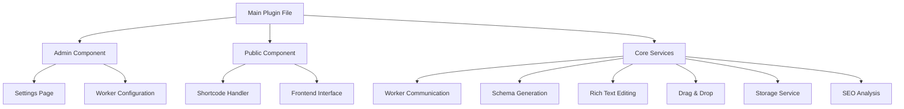

# AI FAQ Generator WordPress Plugin - Implementation Plan

## 📋 Project Overview

This implementation plan transforms the existing JavaScript-based AI FAQ Generator into a fully-featured WordPress plugin, following the specifications outlined in the product requirements document. The plan emphasizes schema generation capabilities, rich text editing, drag-and-drop functionality, and a retro LED-style SEO scoring display.

## 🏗️ Architecture Overview



## 📁 File Structure

```
faq-ai-generator/
├── faq-ai-generator.php              (Main plugin file)
├── admin/
│   ├── class-faq-ai-admin.php        (Admin functionality)
│   ├── js/
│   │   └── admin-scripts.js          (Admin interface JS)
│   ├── css/
│   │   └── admin-styles.css          (Admin interface CSS)
│   └── partials/
│       └── admin-display.php         (Admin page template)
├── includes/
│   ├── class-faq-ai-generator.php    (Core plugin class)
│   ├── class-faq-ai-loader.php       (Hooks and filters)
│   ├── class-faq-ai-i18n.php         (Internationalization)
│   ├── class-worker-communicator.php (Cloudflare API)
│   └── class-schema-generator.php    (Schema generation)
├── public/
│   ├── class-faq-ai-public.php       (Public functionality)
│   ├── js/
│   │   ├── faq-app.js                (Main application)
│   │   ├── services/                 (Service modules)
│   │   │   ├── cloudflare-service.js (Worker communication)
│   │   │   ├── export-service.js     (Export functionality)
│   │   │   ├── faq-generator.js      (FAQ generation)
│   │   │   ├── schema-service.js     (Schema generation)
│   │   │   └── seo-service.js        (SEO analysis)
│   │   ├── controllers/              
│   │   │   └── ui-controller.js      (UI controller)
│   │   └── utils/                    (Utility functions)
│   │       ├── validation.js         (Input validation)
│   │       └── logger.js             (Logging utilities)
│   ├── css/
│   │   ├── faq-generator.css         (Main styles)
│   │   ├── quill.css                 (Editor styles)
│   │   └── led-display.css           (SEO scoring display)
│   └── partials/
│       └── shortcode-display.php     (Shortcode template)
└── vendor/                           (Third-party libraries)
    ├── quill/                        (Rich text editor)
    └── sortable/                     (Drag & drop functionality)
```

## 🛠️ Implementation Plan

### Phase 1: Plugin Foundation (Days 1-3)

#### Day 1: Core Plugin Setup
- Create plugin directory structure
- Implement main plugin file with metadata
- Create activation/deactivation hooks
- Set up internationalization support

#### Day 2: Admin Interface
- Create admin settings page
- Implement worker URL configuration
- Add rate limit settings
- Implement admin styling

#### Day 3: Shortcode Implementation
- Create basic shortcode handler
- Implement attribute parsing (theme, mode, count, colors)
- Set up frontend asset loading
- Create basic shortcode template

### Phase 2: Core Service Integration (Days 4-7)

#### Day 4: Worker Communication
- Port CloudflareService to WordPress
- Implement security measures (nonce verification)
- Create rate limiting system
- Add error handling and logging

#### Day 5-6: UI Controller & Storage
- Port UIController to WordPress
- Implement localStorage integration
- Add version history tracking
- Create import/export functionality
- Implement auto-save capability

#### Day 7: Basic UI Implementation
- Create UI framework
- Implement tab navigation
- Set up form controls
- Ensure responsive design foundations

### Phase 3: Schema Generation (Days 8-10)

#### Day 8: Schema Generator Core
- Create SchemaService class
- Implement JSON-LD generation (Google's preferred format)
- Add schema validation functionality
- Create schema preview system

#### Day 9: Additional Schema Formats
- Implement Microdata generation
- Add RDFa support
- Create HTML markup generator
- Build schema conversion utilities

#### Day 10: Schema UI Integration
- Create schema dropdown selector
- Implement code preview panel
- Add copy to clipboard functionality
- Create download options for each format
- Implement schema format switching

### Phase 4: Enhanced UI Features (Days 11-14)

#### Day 11-12: Rich Text Editing
- Integrate Quill.js editor
- Implement custom toolbar configuration
- Add format preservation
- Create auto-save integration
- Style editor to match theme

#### Day 13: Drag & Drop Functionality
- Integrate SortableJS
- Implement visual feedback during drag
- Add touch support for mobile
- Create bulk operations (select multiple)
- Add sorting animation effects

#### Day 14: SEO Analysis System
- Implement SEO scoring algorithm
- Create multi-color LED-style display
  - Red segments for low scores (0-59)
  - Yellow segments for medium scores (60-79)
  - Green segments for high scores (80-100)
- Add keyword analysis
- Implement readability metrics
- Create SEO improvement suggestions

### Phase 5: Testing & Optimization (Days 15-17)

#### Day 15: Cross-Browser Testing
- Test in Chrome, Firefox, Safari, Edge
- Verify mobile compatibility
- Check touch functionality
- Validate responsive design
- Test in different WordPress themes

#### Day 16: Performance Optimization
- Implement asset minification
- Add conditional script loading
- Optimize API communications
- Enhance caching strategy
- Implement lazy loading

#### Day 17: Elementor Compatibility
- Test with Hello Elementor theme
- Ensure proper styling with Elementor
- Fix any CSS conflicts with high specificity selectors
- Verify shortcode works in Text Editor widget
- Test inside Elementor columns and sections

### Phase 6: Documentation & Finalization (Days 18-20)

#### Day 18: User Documentation
- Create user guide
- Add inline help and tooltips
- Create example FAQs
- Add tutorial content

#### Day 19: Developer Documentation
- Document hooks and filters
- Add code comments
- Create technical documentation
- Add deployment guide

#### Day 20: Final Testing & Release
- Perform final testing
- Create release package
- Version finalization
- Deploy to production

## 🔍 Technical Implementation Details

### Shortcode Implementation

```php
function faq_ai_generator_shortcode($atts) {
  // Parse attributes
  $attributes = shortcode_atts(
    array(
      'theme' => 'default',
      'initial_mode' => 'topic',
      'faq_count' => 10,
      'show_seo' => 'true',
      'primary_color' => '#667eea',
      'secondary_color' => '#764ba2',
      'text_color' => '#2c3e50',
      'background_color' => '#ffffff',
    ),
    $atts
  );
  
  // Enqueue necessary scripts and styles
  wp_enqueue_script('faq-ai-app');
  wp_enqueue_style('faq-ai-styles');
  
  // Load template
  ob_start();
  include plugin_dir_path(__FILE__) . 'partials/shortcode-display.php';
  return ob_get_clean();
}
add_shortcode('ai_faq_generator', 'faq_ai_generator_shortcode');
```

### Schema Generation

#### JSON-LD Implementation

```javascript
generateJsonLd(faqs) {
  return {
    "@context": "https://schema.org",
    "@type": "FAQPage",
    "mainEntity": faqs.map(faq => ({
      "@type": "Question",
      "name": faq.question,
      "acceptedAnswer": {
        "@type": "Answer",
        "text": faq.answer
      }
    }))
  };
}
```

#### Microdata Implementation

```html
<div itemscope itemtype="https://schema.org/FAQPage">
  {{#each faqs}}
    <div itemscope itemprop="mainEntity" itemtype="https://schema.org/Question">
      <h3 itemprop="name">{{question}}</h3>
      <div itemscope itemprop="acceptedAnswer" itemtype="https://schema.org/Answer">
        <div itemprop="text">{{answer}}</div>
      </div>
    </div>
  {{/each}}
</div>
```

#### RDFa Implementation

```html
<div vocab="https://schema.org/" typeof="FAQPage">
  {{#each faqs}}
    <div property="mainEntity" typeof="Question">
      <h3 property="name">{{question}}</h3>
      <div property="acceptedAnswer" typeof="Answer">
        <div property="text">{{answer}}</div>
      </div>
    </div>
  {{/each}}
</div>
```

#### HTML Implementation

```html
<div class="faq-container">
  {{#each faqs}}
    <div class="faq-item" id="faq-{{id}}">
      <h3 class="faq-question">{{question}}</h3>
      <div class="faq-answer">{{answer}}</div>
    </div>
  {{/each}}
</div>
```

### LED-Style SEO Scoring Display

The SEO scoring system will use a retro LED-style display with multi-color indicators:

```css
/* Base LED segment styling */
.led-digit {
  display: inline-block;
  width: 20px;
  height: 35px;
  margin: 0 2px;
  position: relative;
  background: #000;
}

.led-segment {
  position: absolute;
  background: #330000;
  transition: background 0.2s;
}

/* Color variations based on score */
.led-segment.low {
  background: #ff0000;
  box-shadow: 0 0 5px #ff0000;
}

.led-segment.medium {
  background: #ffae00;
  box-shadow: 0 0 5px #ffae00;
}

.led-segment.high {
  background: #00ff00;
  box-shadow: 0 0 5px #00ff00;
}
```

The scoring display will have three categories:
- Overall score (0-100)
- Keyword usage (0-100)
- Readability (0-100)

Each score will be shown with the appropriate color:
- 0-59: Red segments
- 60-79: Yellow segments
- 80-100: Green segments

### Schema Presentation UI

The schema presentation will use a dropdown with code preview:

```html
<div class="schema-selector">
  <label for="schema-format">Choose Schema Format:</label>
  <select id="schema-format">
    <option value="json-ld">JSON-LD (Google Preferred)</option>
    <option value="microdata">Microdata</option>
    <option value="rdfa">RDFa</option>
    <option value="html">HTML</option>
  </select>
  
  <div class="schema-actions">
    <button id="copy-schema" class="button">Copy to Clipboard</button>
    <button id="download-schema" class="button">Download</button>
  </div>
</div>

<div class="schema-preview">
  <pre><code id="schema-code" class="language-html">
    <!-- Schema content will be inserted here -->
  </code></pre>
</div>
```

The preview will update in real-time as the user changes the selected format.

## 🔒 Security & Performance Considerations

### Security Measures

- Implement proper nonce verification for all admin actions
- Sanitize and validate all user inputs
- Use WordPress capability checks for admin functions
- Implement CSRF protection
- Set up proper data escaping for all output

### Performance Optimization

- Load assets only when shortcode is present
- Use minified versions of all scripts and styles
- Implement caching for API responses
- Use batch processing for large data sets
- Optimize localStorage usage to prevent bloat

### Elementor Compatibility

- Use high specificity CSS selectors to override Elementor styles
- Test thoroughly within Elementor Text Editor widget
- Ensure proper functionality in various Elementor layouts
- Create fallback styles for Elementor themes
- Test in mobile and responsive Elementor containers

## 📱 Responsive Design

The plugin will be fully responsive across all devices:

- Desktop optimization (standard view)
- Tablet-friendly layout (reorganized panels)
- Mobile design (stacked interface with touch controls)
- Touch-friendly controls for drag & drop
- Adaptive LED display sizing

## 🚀 Next Steps

Upon approval of this implementation plan, we will:

1. Set up the basic plugin structure
2. Implement the core functionality
3. Build the schema generation system
4. Add the enhanced UI features
5. Test and optimize the solution
6. Deliver the final plugin

The estimated completion timeline is 20 working days from commencement.