# Phase 3: Backend Admin System - Complete Implementation Plan

## 📋 Overview

This document provides the unified implementation plan for Phase 3: Backend Admin System for the 365i AI FAQ Generator WordPress plugin. Phase 3 completes the admin dashboard functionality by implementing the missing backend AJAX handlers, worker health checks, IP-based rate limiting administration, violation monitoring, persistent offender blocking, and a comprehensive analytics dashboard for usage insights.

## 🎯 Current Status & Goals

### ✅ **Completed (Phases 1-2):**
- ✅ Core plugin architecture and file structure
- ✅ 6 Cloudflare workers fully deployed and operational
- ✅ Professional admin interface with modern UI
- ✅ Basic worker wrapper classes with simple rate limiting
- ✅ Admin templates and frontend shortcode system
- ✅ Basic WordPress plugin infrastructure

### 🎯 **Phase 3 Goals:**
- ✅ Complete admin dashboard functionality with enterprise-grade monitoring
- ✅ Worker health check and connection testing system
- ✅ IP-based rate limiting administration interface  
- ✅ Violation monitoring and alerting system
- ✅ Persistent offender IP blocking system
- ✅ Comprehensive analytics dashboard with usage statistics
- ✅ Enhanced settings management and persistence
- ✅ Missing AJAX handlers for admin functionality

## 🏗️ Architecture Overview

```mermaid
graph TB
    A[Phase 3: Backend Admin System] --> B[IP-Based Rate Limiting]
    A --> C[Missing AJAX Handlers]
    A --> D[Worker Health Checks]
    A --> E[Violation Monitoring]
    A --> F[IP Blocking System]
    A --> G[Analytics Dashboard]
    A --> H[Enhanced Settings]
    
    B --> B1[Frontend Client IP Tracking]
    B --> B2[Admin Whitelist System]
    B --> B3[Per-IP Usage Counters]
    
    C --> C1[ajax_test_worker]
    C --> C2[ajax_reset_worker_usage]
    C --> C3[ajax_get_worker_status]
    C --> C4[ajax_save_settings]
    C --> C5[ajax_get_violations]
    C --> C6[ajax_block_ip]
    C --> C7[ajax_unblock_ip]
    C --> C8[ajax_get_analytics]
    
    D --> D1[Cloudflare Worker /health Endpoints]
    D --> D2[WordPress Connection Testing]
    D --> D3[Real-time Status Monitoring]
    
    E --> E1[Violation Logging System]
    E --> E2[Email Alert System]
    E --> E3[Admin Dashboard Widgets]
    E --> E4[Threshold Management]
    
    F --> F1[Automatic IP Blocking]
    F --> F2[Manual Block Management]
    F --> F3[Whitelist Administration]
    F --> F4[Time-based Expiration]
    
    G --> G1[Usage Statistics Tracking]
    G --> G2[Worker Performance Metrics]
    G --> G3[Daily/Weekly/Monthly Reports]
    G --> G4[CSV/JSON Export]
    
    H --> H1[Rate Limiting Configuration]
    H --> H2[Violation Thresholds]
    H --> H3[Alert Preferences]
    H --> H4[Monitoring Settings]
```



## 🛠️ Implementation Components

### **1. Enhanced IP-Based Rate Limiting System**

#### **1.1 Client IP Tracking (Frontend Users Only)**

**Objective**: Transform current simple rate limiting into comprehensive IP-based system for frontend shortcode users.

**Implementation Strategy**:
- Track only frontend client IPs (users accessing the `[ai_faq_generator]` shortcode)
- Admin users in WordPress dashboard are exempt and can override limits
- Whitelist system allows specific IPs to bypass all restrictions

**Key Changes to [`includes/class-ai-faq-workers.php`](includes/class-ai-faq-workers.php)**:

```php
/**
 * Enhanced IP-based rate limiting with frontend-only tracking.
 * 
 * @param string $worker_name Worker identifier
 * @param string $ip_address Client IP address  
 * @return bool|WP_Error True if within limits, WP_Error if exceeded
 */
private function check_ip_rate_limit($worker_name, $ip_address) {
    // Check admin whitelist first
    if ($this->is_ip_whitelisted($ip_address)) {
        return true;
    }
    
    // Check if IP is blocked
    if ($this->is_ip_blocked($ip_address)) {
        return new WP_Error('ip_blocked', 'IP address is blocked');
    }
    
    // Check rate limit for this IP + worker combination
    $rate_limit_key = "ai_faq_rate_{$worker_name}_" . md5($ip_address);
    $current_count = get_transient($rate_limit_key);
    $rate_limit = $this->get_worker_rate_limit($worker_name);
    
    if ($current_count && $current_count >= $rate_limit) {
        // Log the violation
        $this->log_rate_limit_violation($ip_address, $worker_name, $current_count, $rate_limit);
        
        return new WP_Error('rate_limit_exceeded', 
            sprintf('Rate limit exceeded: %d/%d requests used', $current_count, $rate_limit)
        );
    }
    
    return true;
}
```

#### **1.2 IP Whitelist Management**

**Admin Interface Features**:
- Add/remove IP addresses from whitelist
- Bulk whitelist operations
- Whitelist reason tracking
- Automatic admin IP detection and suggestion

**Storage**: WordPress option `ai_faq_ip_whitelist`
```php
$whitelist = [
    '192.168.1.100' => [
        'added_by' => 'admin',
        'added_at' => time(),
        'reason' => 'Office IP address',
        'status' => 'active'
    ]
];
```

### **2. Missing AJAX Handlers Implementation**

#### **2.1 Core AJAX Infrastructure**

**File**: [`includes/class-ai-faq-admin.php`](includes/class-ai-faq-admin.php)

**Add to `init()` method:**
```php
// AJAX handlers for admin functionality
add_action('wp_ajax_ai_faq_test_worker', array($this, 'ajax_test_worker'));
add_action('wp_ajax_ai_faq_reset_worker_usage', array($this, 'ajax_reset_worker_usage'));
add_action('wp_ajax_ai_faq_get_worker_status', array($this, 'ajax_get_worker_status'));
add_action('wp_ajax_ai_faq_save_settings', array($this, 'ajax_save_settings'));
add_action('wp_ajax_ai_faq_get_violations', array($this, 'ajax_get_violations'));
add_action('wp_ajax_ai_faq_block_ip', array($this, 'ajax_block_ip'));
add_action('wp_ajax_ai_faq_unblock_ip', array($this, 'ajax_unblock_ip'));
add_action('wp_ajax_ai_faq_get_analytics', array($this, 'ajax_get_analytics'));
```

#### **2.2 Individual Handler Implementation**

**Test Worker Connection (`ajax_test_worker`)**:
- Send GET request to worker's `/health` endpoint
- Verify response format and status
- Return connection status, response time, error details
- Timeout handling (10 second maximum)
- Capability check: `manage_options`

**Reset Worker Usage (`ajax_reset_worker_usage`)**:
- Clear IP-based rate limiting transients for all IPs for specific worker
- Clear violation logs for that worker
- Update admin dashboard display
- Log admin action for audit trail

**Get Worker Status (`ajax_get_worker_status`)**:
- Check health of all configured workers
- Return current usage statistics per worker
- Include violation counts and blocked IPs
- Update dashboard display data in real-time

**Save Settings (`ajax_save_settings`)**:
- Validate all form inputs with WordPress sanitization
- Update WordPress options with new configuration
- Update individual worker configurations
- Return validation errors if any issues found

### **3. Cloudflare Worker Health Check System**

#### **3.1 Health Check Endpoint Implementation**

**Priority Implementation**: Add to each of the 6 Cloudflare workers first.

**Standard Health Check Response**:
```javascript
// Add this to each worker's index.js file
if (request.method === 'GET' && url.pathname === '/health') {
    return new Response(JSON.stringify({
        status: 'healthy',
        worker: 'worker-specific-name', // e.g., 'question-generator'
        timestamp: Date.now(),
        version: '1.0.0',
        model: '@cf/meta/llama-3.1-8b-instruct', // Worker's AI model
        endpoints: ['/'], // Available endpoints
        rate_limit: {
            requests_per_hour: 100, // Worker's configured limit
            current_usage: 0 // Would be dynamic in full implementation
        },
        performance: {
            avg_response_time: '3.2s',
            uptime_percentage: 99.9
        }
    }), {
        status: 200,
        headers: { 
            'Content-Type': 'application/json',
            'Access-Control-Allow-Origin': '*',
            'Cache-Control': 'no-cache'
        }
    });
}
```

#### **3.2 Worker-Specific Health Responses**

**Question Generator** (`faq-realtime-assistant-worker`):
- Returns question generation capabilities and model info
- Current contextual processing status

**Answer Generator** (`faq-answer-generator-worker`):
- Returns answer processing status and model info
- Mode capabilities (generate, improve, validate, expand)

**FAQ Enhancer** (`faq-enhancement-worker`):
- Returns enhancement capabilities and processing status
- Page context extraction status

**SEO Analyzer** (`faq-seo-analyzer-worker`):
- Returns analysis capabilities and current load
- SEO scoring system status

**FAQ Extractor** (`faq-proxy-fetch`):
- Returns proxy service status and extraction capabilities
- Supported schema formats (JSON-LD, Microdata, RDFa)

**Topic Generator** (`url-to-faq-generator-worker`):
- Returns topic generation status and model info
- Deep analysis processing capabilities

#### **3.3 WordPress Health Monitoring**

**Implementation in [`includes/class-ai-faq-workers.php`](includes/class-ai-faq-workers.php)**:

```php
/**
 * Test worker health by calling /health endpoint.
 * 
 * @param string $worker_name Worker to test
 * @return array Health check results
 */
public function test_worker_health($worker_name) {
    if (!isset($this->workers[$worker_name])) {
        return [
            'status' => 'error',
            'message' => 'Worker not configured'
        ];
    }
    
    $worker_config = $this->workers[$worker_name];
    $health_url = rtrim($worker_config['url'], '/') . '/health';
    
    $response = wp_remote_get($health_url, [
        'timeout' => 10,
        'headers' => [
            'User-Agent' => 'WordPress/365i-AI-FAQ-Generator-Health-Check'
        ]
    ]);
    
    if (is_wp_error($response)) {
        return [
            'status' => 'error',
            'message' => $response->get_error_message(),
            'response_time' => null
        ];
    }
    
    $response_code = wp_remote_retrieve_response_code($response);
    $response_body = wp_remote_retrieve_body($response);
    
    if ($response_code === 200) {
        $health_data = json_decode($response_body, true);
        return [
            'status' => 'healthy',
            'data' => $health_data,
            'response_time' => $this->get_response_time($response)
        ];
    }
    
    return [
        'status' => 'unhealthy',
        'http_code' => $response_code,
        'response_time' => $this->get_response_time($response)
    ];
}
```

### **4. Violation Monitoring and Alerting System**

#### **4.1 Violation Detection and Logging**

**Enhanced Rate Limiting with Violation Tracking**:

```php
/**
 * Log rate limit violation with detailed tracking.
 * 
 * @param string $ip_address Client IP
 * @param string $worker_name Worker identifier
 * @param int $current_count Current usage count
 * @param int $rate_limit Rate limit threshold
 */
private function log_rate_limit_violation($ip_address, $worker_name, $current_count, $rate_limit) {
    $violations = get_option('ai_faq_violations_log', []);
    
    $violation = [
        'ip' => $ip_address,
        'worker' => $worker_name,
        'timestamp' => time(),
        'count' => $current_count,
        'limit' => $rate_limit,
        'user_agent' => $_SERVER['HTTP_USER_AGENT'] ?? '',
        'severity' => $this->calculate_violation_severity($current_count, $rate_limit),
        'page_url' => $_SERVER['HTTP_REFERER'] ?? ''
    ];
    
    $violations[] = $violation;
    
    // Maintain rolling log: keep last 1000 violations, 30-day retention
    $violations = array_slice($violations, -1000);
    $violations = array_filter($violations, function($v) {
        return $v['timestamp'] > (time() - (30 * DAY_IN_SECONDS));
    });
    
    update_option('ai_faq_violations_log', $violations);
    
    // Check if this should trigger consequences
    $this->process_violation_consequences($ip_address, $worker_name);
}
```

#### **4.2 Alert System Implementation**

**Alert Triggers and Thresholds**:
- **Single IP**: 3+ violations in 1 hour = Email admin
- **Any Worker**: 10+ total violations in 1 hour = Email admin  
- **Severe**: 50+ violations in 1 hour = Email + admin dashboard notice
- **Critical**: 100+ violations in 1 hour = Email + dashboard + auto-block top violators

**Email Alert Implementation**:
```php
/**
 * Send violation alert email to admin.
 * 
 * @param string $alert_type Type of alert (threshold_reached, ip_blocked, etc.)
 * @param array $data Alert data
 */
private function send_violation_alert($alert_type, $data) {
    $admin_email = get_option('admin_email');
    $site_name = get_bloginfo('name');
    
    $subject = sprintf('[%s] AI FAQ Generator - Rate Limit Violation Alert', $site_name);
    
    $message = sprintf(
        "Rate limit violations detected on %s:\n\n" .
        "Alert Type: %s\n" .
        "IP Address: %s\n" .
        "Worker: %s\n" .
        "Violation Count: %d\n" .
        "Time: %s\n\n" .
        "Admin Dashboard: %s",
        $site_name,
        $alert_type,
        $data['ip'],
        $data['worker'],
        $data['count'],
        date('Y-m-d H:i:s', $data['timestamp']),
        admin_url('admin.php?page=ai-faq-generator')
    );
    
    // Rate limit alerts: max 1 email per hour per IP
    $alert_key = 'ai_faq_alert_' . md5($data['ip']);
    if (!get_transient($alert_key)) {
        wp_mail($admin_email, $subject, $message);
        set_transient($alert_key, 1, HOUR_IN_SECONDS);
    }
}
```

#### **4.3 Admin Dashboard Violation Widget**

**Add to [`templates/admin/dashboard.php`](templates/admin/dashboard.php)**:

```php
<!-- Violations Monitoring Widget -->
<div class="ai-faq-gen-section violations-section">
    <h3>
        <span class="dashicons dashicons-warning"></span>
        Rate Limit Violations (Last 24h)
        <button class="button button-small" id="refresh-violations">Refresh</button>
    </h3>
    
    <div class="violations-summary">
        <div class="violation-stat">
            <span class="count" id="total-violations">0</span>
            <span class="label">Total Violations</span>
        </div>
        <div class="violation-stat">
            <span class="count" id="unique-ips">0</span>
            <span class="label">Unique IPs</span>
        </div>
        <div class="violation-stat">
            <span class="count" id="blocked-ips">0</span>
            <span class="label">Blocked IPs</span>
        </div>
        <div class="violation-stat">
            <span class="count" id="alerts-sent">0</span>
            <span class="label">Alerts Sent</span>
        </div>
    </div>
    
    <div class="top-violators">
        <h4>Top Violating IPs (24h)</h4>
        <table class="violations-table widefat">
            <thead>
                <tr>
                    <th>IP Address</th>
                    <th>Violations</th>
                    <th>Workers Affected</th>
                    <th>Last Violation</th>
                    <th>Status</th>
                    <th>Actions</th>
                </tr>
            </thead>
            <tbody id="violations-list">
                <!-- Populated by AJAX -->
            </tbody>
        </table>
    </div>
</div>
```

### **5. IP Blocking System for Persistent Offenders**

#### **5.1 Automatic IP Blocking Logic**

```php
/**
 * Process violation consequences including automatic blocking.
 * 
 * @param string $ip_address Client IP
 * @param string $worker_name Worker name
 */
private function process_violation_consequences($ip_address, $worker_name) {
    $violations_last_hour = $this->get_violations_last_hour($ip_address);
    $total_violations = count($violations_last_hour);
    
    // Get configurable thresholds
    $violation_threshold = get_option('ai_faq_violation_threshold', 3);
    $auto_block_threshold = get_option('ai_faq_auto_block_threshold', 5);
    
    // Send alert if threshold reached
    if ($total_violations >= $violation_threshold) {
        $this->send_violation_alert('threshold_reached', [
            'ip' => $ip_address,
            'worker' => $worker_name,
            'count' => $total_violations,
            'timestamp' => time()
        ]);
    }
    
    // Auto-block if severe threshold reached
    if ($total_violations >= $auto_block_threshold) {
        $this->block_ip_address($ip_address, 'auto', 
            sprintf('Exceeded violation threshold (%d violations)', $total_violations)
        );
        
        $this->send_violation_alert('ip_blocked', [
            'ip' => $ip_address,
            'worker' => $worker_name,
            'count' => $total_violations,
            'timestamp' => time()
        ]);
    }
}
```

#### **5.2 IP Block Management**

**Block Storage Structure**:
```php
// WordPress option: ai_faq_blocked_ips
$blocked_ips = [
    '192.168.1.100' => [
        'blocked_at' => time(),
        'expires_at' => time() + (24 * HOUR_IN_SECONDS),
        'block_type' => 'auto', // 'auto' or 'manual'
        'reason' => 'Exceeded violation threshold',
        'violation_count' => 7,
        'blocked_by' => 'system', // or admin username
        'can_appeal' => true
    ]
];
```

**Block Checking Integration**:
```php
/**
 * Check if IP is currently blocked.
 * 
 * @param string $ip_address IP to check
 * @return bool|array False if not blocked, block info if blocked
 */
private function is_ip_blocked($ip_address) {
    $blocked_ips = get_option('ai_faq_blocked_ips', []);
    
    if (!isset($blocked_ips[$ip_address])) {
        return false;
    }
    
    $block_info = $blocked_ips[$ip_address];
    
    // Check if block has expired
    if (time() > $block_info['expires_at']) {
        unset($blocked_ips[$ip_address]);
        update_option('ai_faq_blocked_ips', $blocked_ips);
        return false;
    }
    
    return $block_info;
}
```

#### **5.3 Admin Block Management Interface**

**Add to admin dashboard**:
```php
<!-- IP Block Management Section -->
<div class="ai-faq-gen-section block-management-section">
    <h3>
        <span class="dashicons dashicons-shield"></span>
        IP Block Management
    </h3>
    
    <!-- Manual IP Blocking -->
    <div class="manual-block">
        <h4>Block IP Address</h4>
        <form id="block-ip-form" class="block-ip-form">
            <div class="form-row">
                <label for="block_ip_address">IP Address:</label>
                <input type="text" id="block_ip_address" name="ip_address" 
                       placeholder="192.168.1.100" pattern="^(?:[0-9]{1,3}\.){3}[0-9]{1,3}$" required>
            </div>
            
            <div class="form-row">
                <label for="block_reason">Reason:</label>
                <input type="text" id="block_reason" name="reason" 
                       placeholder="Manual block - suspicious activity">
            </div>
            
            <div class="form-row">
                <label for="block_duration">Duration:</label>
                <select id="block_duration" name="duration">
                    <option value="1">1 hour</option>
                    <option value="24" selected>24 hours</option>
                    <option value="168">1 week</option>
                    <option value="720">1 month</option>
                    <option value="0">Permanent</option>
                </select>
            </div>
            
            <button type="submit" class="button button-primary">Block IP</button>
        </form>
    </div>
    
    <!-- Currently Blocked IPs -->
    <div class="blocked-ips-list">
        <h4>Currently Blocked IPs</h4>
        <table class="blocked-ips-table widefat">
            <thead>
                <tr>
                    <th>IP Address</th>
                    <th>Blocked At</th>
                    <th>Expires</th>
                    <th>Type</th>
                    <th>Reason</th>
                    <th>Violations</th>
                    <th>Actions</th>
                </tr>
            </thead>
            <tbody id="blocked-ips-list">
                <!-- Populated by AJAX -->
            </tbody>
        </table>
    </div>
    
    <!-- IP Whitelist Management -->
    <div class="whitelist-management">
        <h4>IP Whitelist Management</h4>
        <p class="description">IPs in the whitelist are never subject to rate limiting or blocking.</p>
        
        <form id="whitelist-form" class="whitelist-form">
            <div class="form-row">
                <label for="whitelist_ip">IP Address:</label>
                <input type="text" id="whitelist_ip" name="whitelist_ip" 
                       placeholder="192.168.1.100" pattern="^(?:[0-9]{1,3}\.){3}[0-9]{1,3}$">
                
                <label for="whitelist_reason">Reason:</label>
                <input type="text" id="whitelist_reason" name="whitelist_reason" 
                       placeholder="Office IP address">
                
                <button type="submit" class="button">Add to Whitelist</button>
            </div>
        </form>
        
        <div id="whitelist-ips" class="whitelist-display">
            <!-- Populated by AJAX -->
        </div>
    </div>
</div>
```

### **6. Comprehensive Analytics Dashboard**

#### **6.1 Usage Statistics Tracking**

**New File**: [`includes/class-ai-faq-analytics.php`](includes/class-ai-faq-analytics.php)

```php
<?php
/**
 * Analytics tracking and reporting class.
 * 
 * @package AI_FAQ_Generator
 * @subpackage Analytics
 * @since 2.0.0
 */

class AI_FAQ_Analytics {
    
    /**
     * Track worker usage with comprehensive metrics.
     * 
     * @param string $worker_name Worker identifier
     * @param string $ip_address Client IP address  
     * @param bool $success Whether request was successful
     * @param float $response_time Response time in seconds
     */
    public function track_usage($worker_name, $ip_address, $success = true, $response_time = 0) {
        $stats = get_option('ai_faq_usage_stats', []);
        $today = date('Y-m-d');
        
        // Initialize daily stats if not exists
        if (!isset($stats[$today])) {
            $stats[$today] = [
                'total_requests' => 0,
                'successful_requests' => 0,
                'failed_requests' => 0,
                'unique_ips' => [],
                'total_response_time' => 0,
                'workers' => []
            ];
        }
        
        // Update daily totals
        $stats[$today]['total_requests']++;
        $stats[$today]['total_response_time'] += $response_time;
        
        if ($success) {
            $stats[$today]['successful_requests']++;
        } else {
            $stats[$today]['failed_requests']++;
        }
        
        // Track unique IPs (hashed for privacy)
        $ip_hash = md5($ip_address . date('Y-m-d')); // Daily unique tracking
        $stats[$today]['unique_ips'][$ip_hash] = 1;
        
        // Track per-worker usage
        if (!isset($stats[$today]['workers'][$worker_name])) {
            $stats[$today]['workers'][$worker_name] = [
                'requests' => 0,
                'success' => 0,
                'failed' => 0,
                'total_response_time' => 0
            ];
        }
        
        $stats[$today]['workers'][$worker_name]['requests']++;
        $stats[$today]['workers'][$worker_name]['total_response_time'] += $response_time;
        
        if ($success) {
            $stats[$today]['workers'][$worker_name]['success']++;
        } else {
            $stats[$today]['workers'][$worker_name]['failed']++;
        }
        
        // Keep only last 90 days of stats
        $cutoff_date = date('Y-m-d', strtotime('-90 days'));
        $stats = array_filter($stats, function($key) use ($cutoff_date) {
            return $key >= $cutoff_date;
        }, ARRAY_FILTER_USE_KEY);
        
        update_option('ai_faq_usage_stats', $stats);
    }
    
    /**
     * Get summary statistics for dashboard.
     * 
     * @param int $days Number of days to analyze
     * @return array Summary statistics
     */
    public function get_summary_stats($days = 30) {
        $stats = get_option('ai_faq_usage_stats', []);
        $start_date = date('Y-m-d', strtotime("-{$days} days"));
        
        $totals = [
            'total_requests' => 0,
            'successful_requests' => 0,
            'failed_requests' => 0,
            'unique_ips' => [],
            'avg_response_time' => 0,
            'total_response_time' => 0
        ];
        
        foreach ($stats as $date => $daily_stats) {
            if ($date >= $start_date) {
                $totals['total_requests'] += $daily_stats['total_requests'];
                $totals['successful_requests'] += $daily_stats['successful_requests'];
                $totals['failed_requests'] += $daily_stats['failed_requests'];
                $totals['unique_ips'] = array_merge($totals['unique_ips'], $daily_stats['unique_ips']);
                $totals['total_response_time'] += $daily_stats['total_response_time'];
            }
        }
        
        // Calculate derived metrics
        $totals['success_rate'] = $totals['total_requests'] > 0 
            ? round(($totals['successful_requests'] / $totals['total_requests']) * 100, 1)
            : 0;
            
        $totals['daily_average'] = round($totals['total_requests'] / max($days, 1), 1);
        
        $totals['avg_response_time'] = $totals['total_requests'] > 0
            ? round($totals['total_response_time'] / $totals['total_requests'], 2)
            : 0;
            
        $totals['unique_users'] = count($totals['unique_ips']);
        
        return $totals;
    }
}
```

#### **6.2 Analytics Dashboard Widget**

**Add to [`templates/admin/dashboard.php`](templates/admin/dashboard.php)**:

```php
<!-- Analytics Overview Widget -->
<div class="ai-faq-gen-section analytics-section">
    <h3>
        <span class="dashicons dashicons-chart-area"></span>
        Usage Analytics
        <select id="analytics-period" class="analytics-period-selector">
            <option value="7">Last 7 Days</option>
            <option value="30" selected>Last 30 Days</option>
            <option value="90">Last 90 Days</option>
        </select>
        <button class="button button-small" id="refresh-analytics">Refresh</button>
    </h3>
    
    <!-- Summary Statistics Cards -->
    <div class="analytics-summary">
        <div class="analytics-stat">
            <span class="count" id="total-requests">0</span>
            <span class="label">Total Requests</span>
            <span class="trend" id="requests-trend"></span>
        </div>
        <div class="analytics-stat">
            <span class="count" id="success-rate">0%</span>
            <span class="label">Success Rate</span>
            <span class="trend" id="success-trend"></span>
        </div>
        <div class="analytics-stat">
            <span class="count" id="daily-average">0</span>
            <span class="label">Daily Average</span>
            <span class="trend" id="daily-trend"></span>
        </div>
        <div class="analytics-stat">
            <span class="count" id="unique-users">0</span>
            <span class="label">Unique Users</span>
            <span class="trend" id="users-trend"></span>
        </div>
        <div class="analytics-stat">
            <span class="count" id="avg-response-time">0s</span>
            <span class="label">Avg Response Time</span>
            <span class="trend" id="response-trend"></span>
        </div>
    </div>
    
    <!-- Usage Trend Chart (Simple HTML/CSS Implementation) -->
    <div class="usage-chart-container">
        <h4>Daily Usage Trend</h4>
        <div class="simple-chart" id="usage-chart">
            <div class="chart-legend">
                <span class="legend-item">
                    <span class="legend-color success"></span>
                    Successful Requests
                </span>
                <span class="legend-item">
                    <span class="legend-color failed"></span>
                    Failed Requests
                </span>
            </div>
            <div class="chart-bars" id="chart-bars">
                <!-- Populated by JavaScript -->
            </div>
        </div>
    </div>
    
    <!-- Worker Performance Table -->
    <div class="worker-performance">
        <h4>Worker Performance (Selected Period)</h4>
        <table class="worker-stats-table widefat">
            <thead>
                <tr>
                    <th>Worker</th>
                    <th>Requests</th>
                    <th>Success Rate</th>
                    <th>Avg Response Time</th>
                    <th>Health Status</th>
                    <th>Rate Limit Usage</th>
                </tr>
            </thead>
            <tbody id="worker-performance-list">
                <!-- Populated by AJAX -->
            </tbody>
        </table>
    </div>
    
    <!-- Export Options -->
    <div class="analytics-export">
        <h4>Export Analytics Data</h4>
        <div class="export-buttons">
            <button type="button" class="button" id="export-csv">
                <span class="dashicons dashicons-media-spreadsheet"></span>
                Export CSV
            </button>
            <button type="button" class="button" id="export-json">
                <span class="dashicons dashicons-media-code"></span>
                Export JSON
            </button>
            <button type="button" class="button" id="export-summary">
                <span class="dashicons dashicons-media-document"></span>
                Summary Report
            </button>
        </div>
    </div>
</div>
```

### **7. Enhanced Settings Management**

#### **7.1 Complete Settings Structure**

**Enhanced `ai_faq_gen_options` structure**:
```php
$default_options = [
    'version' => AI_FAQ_GEN_VERSION,
    
    // Worker configurations (existing + enhanced)
    'workers' => [
        'question_generator' => [
            'url' => 'https://faq-realtime-assistant-worker.winter-cake-bf57.workers.dev',
            'enabled' => true,
            'rate_limit' => 100,
            'timeout' => 30,
            'retry_attempts' => 3
        ],
        // ... other workers
    ],
    
    // Rate limiting settings
    'rate_limiting' => [
        'enabled' => true,
        'default_limit' => 50,
        'default_period' => 'hour', // hour, day, week
        'violation_threshold' => 3,
        'auto_block_threshold' => 5,
        'block_duration' => 24, // hours
        'whitelist_ips' => [],
        'enable_alerts' => true,
        'alert_email' => get_option('admin_email'),
        'alert_rate_limit' => 1 // max alerts per hour per IP
    ],
    
    // Monitoring settings
    'monitoring' => [
        'log_violations' => true,
        'log_retention_days' => 30,
        'dashboard_widget' => true,
        'email_alerts' => true,
        'health_check_interval' => 300, // seconds
        'track_analytics' => true,
        'analytics_retention_days' => 90
    ],
    
    // Security settings
    'security' => [
        'strict_ip_checking' => true,
        'proxy_detection' => true,
        'user_agent_logging' => true,
        'referrer_logging' => true
    ],
    
    // General settings (existing)
    'settings' => [
        'default_faq_count' => 12,
        'auto_save_interval' => 3,
        'debug_mode' => false
    ]
];
```

#### **7.2 Enhanced Settings Forms**

**Add to [`templates/admin/settings.php`](templates/admin/settings.php)**:

```php
<!-- Rate Limiting Configuration Section -->
<div class="ai-faq-gen-section rate-limiting-section">
    <h3>IP-Based Rate Limiting Configuration</h3>
    
    <table class="form-table">
        <tr>
            <th scope="row">Enable Rate Limiting</th>
            <td>
                <label>
                    <input type="checkbox" name="ai_faq_gen_options[rate_limiting][enabled]" value="1" 
                           <?php checked($options['rate_limiting']['enabled'] ?? true); ?>>
                    Enable IP-based rate limiting for frontend users
                </label>
            </td>
        </tr>
        
        <tr>
            <th scope="row">Default Rate Limit</th>
            <td>
                <input type="number" name="ai_faq_gen_options[rate_limiting][default_limit]" 
                       value="<?php echo intval($options['rate_limiting']['default_limit'] ?? 50); ?>" 
                       min="1" max="1000"> requests per
                <select name="ai_faq_gen_options[rate_limiting][default_period]">
                    <option value="hour" <?php selected($options['rate_limiting']['default_period'] ?? 'hour', 'hour'); ?>>Hour</option>
                    <option value="day" <?php selected($options['rate_limiting']['default_period'] ?? 'hour', 'day'); ?>>Day</option>
                    <option value="week" <?php selected($options['rate_limiting']['default_period'] ?? 'hour', 'week'); ?>>Week</option>
                </select>
                <p class="description">Default rate limit applied to all workers unless individually configured.</p>
            </td>
        </tr>
        
        <tr>
            <th scope="row">Violation Alert Threshold</th>
            <td>
                <input type="number" name="ai_faq_gen_options[rate_limiting][violation_threshold]" 
                       value="<?php echo intval($options['rate_limiting']['violation_threshold'] ?? 3); ?>" 
                       min="1" max="10"> violations before sending email alert
                <p class="description">Number of rate limit violations before admin email notification.</p>
            </td>
        </tr>
        
        <tr>
            <th scope="row">Auto-Block Threshold</th>
            <td>
                <input type="number" name="ai_faq_gen_options[rate_limiting][auto_block_threshold]" 
                       value="<?php echo intval($options['rate_limiting']['auto_block_threshold'] ?? 5); ?>" 
                       min="1" max="20"> violations before automatic IP blocking
                <p class="description">Number of violations before automatically blocking the IP address.</p>
            </td>
        </tr>
        
        <tr>
            <th scope="row">Default Block Duration</th>
            <td>
                <input type="number" name="ai_faq_gen_options[rate_limiting][block_duration]" 
                       value="<?php echo intval($options['rate_limiting']['block_duration'] ?? 24); ?>" 
                       min="1" max="8760"> hours
                <p class="description">How long to block IPs automatically (in hours).</p>
            </td>
        </tr>
        
        <tr>
            <th scope="row">Email Alerts</th>
            <td>
                <label>
                    <input type="checkbox" name="ai_faq_gen_options[rate_limiting][enable_alerts]" value="1" 
                           <?php checked($options['rate_limiting']['enable_alerts'] ?? true); ?>>
                    Send email alerts for violations and IP blocks
                </label>
                <br>
                <label for="alert_email">Alert Email:</label>
                <input type="email" id="alert_email" name="ai_faq_gen_options[rate_limiting][alert_email]" 
                       value="<?php echo esc_attr($options['rate_limiting']['alert_email'] ?? get_option('admin_email')); ?>">
            </td>
        </tr>
    </table>
</div>

<!-- Monitoring Settings Section -->
<div class="ai-faq-gen-section monitoring-section">
    <h3>Monitoring & Analytics Configuration</h3>
    
    <table class="form-table">
        <tr>
            <th scope="row">Violation Logging</th>
            <td>
                <label>
                    <input type="checkbox" name="ai_faq_gen_options[monitoring][log_violations]" value="1" 
                           <?php checked($options['monitoring']['log_violations'] ?? true); ?>>
                    Log rate limit violations for analysis
                </label>
            </td>
        </tr>
        
        <tr>
            <th scope="row">Log Retention</th>
            <td>
                <input type="number" name="ai_faq_gen_options[monitoring][log_retention_days]" 
                       value="<?php echo intval($options['monitoring']['log_retention_days'] ?? 30); ?>" 
                       min="1" max="365"> days
                <p class="description">How long to keep violation logs and analytics data.</p>
            </td>
        </tr>
        
        <tr>
            <th scope="row">Usage Analytics</th>
            <td>
                <label>
                    <input type="checkbox" name="ai_faq_gen_options[monitoring][track_analytics]" value="1" 
                           <?php checked($options['monitoring']['track_analytics'] ?? true); ?>>
                    Track usage analytics and performance metrics
                </label>
                <p class="description">Anonymously track usage for dashboard analytics.</p>
            </td>
        </tr>
        
        <tr>
            <th scope="row">Health Check Interval</th>
            <td>
                <select name="ai_faq_gen_options[monitoring][health_check_interval]">
                    <option value="60" <?php selected($options['monitoring']['health_check_interval'] ?? 300, 60); ?>>1 Minute</option>
                    <option value="300" <?php selected($options['monitoring']['health_check_interval'] ?? 300, 300); ?>>5 Minutes</option>
                    <option value="600" <?php selected($options['monitoring']['health_check_interval'] ?? 300, 600); ?>>10 Minutes</option>
                    <option value="1800" <?php selected($options['monitoring']['health_check_interval'] ?? 300, 1800); ?>>30 Minutes</option>
                </select>
                <p class="description">How often to check worker health status.</p>
            </td>
        </tr>
    </table>
</div>
```

## 📁 File Modifications & Creation Summary

### **Files to Modify:**

1. **[`includes/class-ai-faq-admin.php`](includes/class-ai-faq-admin.php)**
   - Add 8 new AJAX handlers with full security implementation
   - Enhanced settings management with new options structure
   - Violation monitoring and IP management integration

2. **[`includes/class-ai-faq-workers.php`](includes/class-ai-faq-workers.php)**
   - Replace simple rate limiting with comprehensive IP-based system
   - Add violation logging to all existing AJAX handlers
   - Implement IP blocking checks and whitelist functionality
   - Add worker health checking methods

3. **[`templates/admin/dashboard.php`](templates/admin/dashboard.php)**
   - Add violations monitoring widget with real-time updates
   - Add IP block management section
   - Add comprehensive analytics dashboard
   - Update statistics display with new metrics

4. **[`templates/admin/workers.php`](templates/admin/workers.php)**
   - Add health check status indicators
   - Add usage reset buttons for each worker
   - Add real-time status monitoring

5. **[`templates/admin/settings.php`](templates/admin/settings.php)**
   - Add rate limiting configuration section
   - Add monitoring preferences section
   - Add alert and security settings
   - Enhance existing settings with new options

6. **[`assets/js/admin.js`](assets/js/admin.js)**
   - Add AJAX handlers for all new admin functionality
   - Add real-time dashboard updates
   - Add analytics chart rendering
   - Add form validation for new settings

7. **[`assets/css/admin.css`](assets/css/admin.css)**
   - Add styling for violations monitoring interface
   - Add analytics dashboard styling
   - Add IP management interface styling
   - Add form enhancements for new settings

### **New Files to Create:**

1. **[`includes/class-ai-faq-analytics.php`](includes/class-ai-faq-analytics.php)**
   - Dedicated analytics tracking and reporting class
   - Usage statistics collection and aggregation
   - Export functionality for CSV/JSON formats
   - Dashboard integration methods

### **Cloudflare Workers to Update:**

All 6 workers need `/health` endpoint implementation:
- **`faq-ai-workers/faq-realtime-assistant-worker/src/index.js`**
- **`faq-ai-workers/faq-answer-generator-worker/src/index.js`**
- **`faq-ai-workers/faq-enhancement-worker/src/index.js`**
- **`faq-ai-workers/faq-seo-analyzer-worker/src/index.js`**
- **`faq-ai-workers/faq-proxy-fetch/src/index.js`**
- **`faq-ai-workers/url-to-faq-generator-worker/src/index.js`**

## ⏱️ Implementation Timeline

### **Priority Order (Based on User Feedback)**

**Day 1: Worker Health Checks (PRIORITY)**
- Add `/health` endpoints to all 6 Cloudflare workers
- Implement WordPress health checking system
- Add worker status monitoring to admin dashboard

**Day 2: Enhanced IP-Based Rate Limiting**
- Transform current rate limiting to IP-based system
- Implement whitelist functionality
- Add violation logging foundation

**Day 3: Missing AJAX Handlers & Admin Controls**
- Implement all 8 missing AJAX handlers
- Add admin interface controls for testing and management
- Integrate with health checking system

**Day 4: Violation Monitoring & IP Blocking**
- Complete violation logging and alerting system
- Implement automatic and manual IP blocking
- Add email notification system

**Day 5: Analytics Dashboard & Final Integration**
- Implement comprehensive analytics tracking
- Create analytics dashboard widgets
- Final testing and optimization

## 🔒 Security & Compliance

### **WordPress Security Standards**
- **CSRF Protection**: All AJAX requests use WordPress nonces
- **Capability Checks**: All admin functions require `manage_options`
- **Input Sanitization**: All inputs properly sanitized using WordPress functions
- **Output Escaping**: All outputs properly escaped with esc_* functions
- **SQL Injection Prevention**: Use WordPress options API (no direct SQL)
- **Rate Limiting Bypass Protection**: IP blocking prevents circumvention
- **Privacy Compliance**: IP addresses hashed for storage, anonymized analytics

### **Performance Considerations**
- **Minimal Database Impact**: Use WordPress options and transients efficiently
- **Smart Caching**: Cache worker health checks and analytics data
- **Efficient Queries**: Optimize data retrieval and aggregation
- **Background Processing**: Health checks and cleanup run in background

## 🎯 Success Criteria

### **Functional Requirements:**
- ✅ All admin dashboard buttons work correctly
- ✅ Worker connection testing provides accurate status
- ✅ IP-based rate limiting functions properly for frontend users only
- ✅ Violation monitoring captures and alerts on abuse
- ✅ IP blocking prevents persistent offenders from access
- ✅ Analytics dashboard provides comprehensive usage insights
- ✅ Settings save and persist correctly
- ✅ Email alerts work reliably

### **Technical Requirements:**
- ✅ Zero PHP errors under WordPress-Plugin PHPCS standard
- ✅ All code properly documented with PHPDoc blocks
- ✅ Security measures implemented throughout
- ✅ Performance optimized (minimal database queries)
- ✅ Compatible with WordPress 5.0+ and PHP 7.4+

## 🚀 Post-Implementation Benefits

Upon completion of Phase 3, the plugin will have:
- **Enterprise-Grade Admin Dashboard** with real-time monitoring capabilities
- **Robust Protection System** against abuse and overuse with intelligent IP management
- **Professional Monitoring** with comprehensive alerting and analytics
- **Complete IP Management** including automatic blocking and manual administration
- **Advanced Configuration** options for fine-tuning all aspects of the system
- **Comprehensive Analytics** for understanding usage patterns and optimizing performance

This transforms the plugin from a basic admin interface into a comprehensive enterprise-grade monitoring and management system suitable for high-traffic deployments while maintaining the frontend-only FAQ generation approach.

---

*This implementation plan provides complete specifications for transforming the 365i AI FAQ Generator into an enterprise-grade WordPress plugin with comprehensive backend administrative capabilities.*