# Phase 3: Backend Admin System - Complete Implementation Plan

## 📋 Overview

This document provides the unified implementation plan for Phase 3: Backend Admin System for the 365i AI FAQ Generator WordPress plugin. Phase 3 completes the admin dashboard functionality by implementing the missing backend AJAX handlers, worker health checks, IP-based rate limiting administration, violation monitoring, persistent offender blocking, and a simple analytics dashboard for usage insights.

## 🎯 Current Status & Goals

### ✅ **Completed (Phases 1-2):**
- ✅ Core plugin architecture and file structure
- ✅ 6 Cloudflare workers fully deployed and operational
- ✅ Individual worker wrapper classes with IP-based rate limiting
- ✅ Admin templates and frontend shortcode system
- ✅ Basic WordPress plugin infrastructure

### 🎯 **Phase 3 Goals:**
- ✅ Complete admin dashboard functionality
- ✅ Worker health check and connection testing
- ✅ Rate limiting administration interface  
- ✅ Violation monitoring and alerting system
- ✅ Persistent offender IP blocking system
- ✅ Simple analytics dashboard with usage statistics
- ✅ Settings management and persistence

## 🏗️ Architecture Overview

```mermaid
graph TB
    A[Phase 3: Backend Admin System] --> B[WordPress AJAX System]
    A --> C[Worker Health Checks]
    A --> D[Rate Limiting Admin]
    A --> E[Violation Monitoring]
    A --> F[IP Blocking System]
    
    B --> B1[Test Connection Handler]
    B --> B2[Reset Usage Handler]
    B --> B3[Settings Save Handler]
    B --> B4[Worker Status Handler]
    
    C --> C1[Health Check Endpoints]
    C --> C2[Connection Testing]
    C --> C3[Status Verification]
    
    D --> D1[Rate Limit Configuration]
    D --> D2[Duration Management]
    D --> D3[Per-Worker Settings]
    
    E --> E1[Violation Logging]
    E --> E2[Alert Thresholds]
    E --> E3[Admin Dashboard Widget]
    E --> E4[Email Notifications]
    
    F --> F1[Automatic IP Blocking]
    F --> F2[Manual Block Management]
    F --> F3[Block Duration Settings]
    F --> F4[Whitelist Management]
A --> G[Analytics Dashboard]
    
    G --> G1[Usage Statistics]
    G --> G2[Worker Performance]  
    G --> G3[Daily/Weekly/Monthly Reports]
    G --> G4[Export Functionality]
```



## 🛠️ Implementation Components

### **1. WordPress Backend AJAX System**

#### **1.1 Missing AJAX Handlers**

**File:** [`includes/class-ai-faq-admin.php`](includes/class-ai-faq-admin.php)

**Add to `init()` method:**
```php
// AJAX handlers for admin functionality
add_action('wp_ajax_ai_faq_test_worker', array($this, 'ajax_test_worker'));
add_action('wp_ajax_ai_faq_reset_worker_usage', array($this, 'ajax_reset_worker_usage'));  
add_action('wp_ajax_ai_faq_get_worker_status', array($this, 'ajax_get_worker_status'));
add_action('wp_ajax_ai_faq_save_settings', array($this, 'ajax_save_settings'));
add_action('wp_ajax_ai_faq_get_violations', array($this, 'ajax_get_violations'));
add_action('wp_ajax_ai_faq_block_ip', array($this, 'ajax_block_ip'));
add_action('wp_ajax_ai_faq_unblock_ip', array($this, 'ajax_unblock_ip'));
add_action('wp_ajax_ai_faq_get_analytics', array($this, 'ajax_get_analytics'));

```

#### **1.2 Handler Implementation Details**

**Test Worker Connection (`ajax_test_worker`):**
- Send GET request to worker's `/health` endpoint
- Verify response format and status
- Return success/failure with detailed error messages
- Timeout handling (10 second max)

**Reset Worker Usage (`ajax_reset_worker_usage`):**
- Clear specific worker's rate limiting transients for all IPs
- Clear violation logs for that worker
- Update admin dashboard display
- Log admin action

**Save Settings (`ajax_save_settings`):**
- Validate all form inputs
- Sanitize and save to `ai_faq_gen_options`
- Update individual worker configurations
- Return validation errors if any

**Get Worker Status (`ajax_get_worker_status`):**
- Check health of all configured workers
- Return current usage statistics
- Include violation counts and blocked IPs
- Update dashboard display data

### **2. Cloudflare Worker Health Check System**

#### **2.1 Health Check Endpoint Implementation**

**Add to each of the 6 Cloudflare workers:**

```javascript
// Health check endpoint for admin testing
if (request.method === 'GET' && url.pathname === '/health') {
    return new Response(JSON.stringify({
        status: 'healthy',
        worker: 'question-generator', // Specific worker name
        timestamp: Date.now(),
        version: '1.0.0',
        model: '@cf/meta/llama-3.1-8b-instruct', // Worker's AI model
        rate_limit: {
            requests_per_hour: 100,
            current_usage: 0 // Would be dynamic in real implementation
        }
    }), {
        status: 200,
        headers: { 
            'Content-Type': 'application/json',
            'Access-Control-Allow-Origin': '*'
        }
    });
}
```

#### **2.2 Worker-Specific Health Responses**

**Question Generator:** Returns model info and generation capabilities
**Answer Generator:** Returns answer processing status and model info
**FAQ Enhancer:** Returns enhancement capabilities and processing status
**SEO Analyzer:** Returns analysis capabilities and current load
**FAQ Extractor:** Returns proxy service status and extraction capabilities  
**Topic Generator:** Returns topic generation status and model info

### **3. Rate Limiting Administration**

#### **3.1 Enhanced Rate Limit Configuration**

**Settings Addition to `templates/admin/settings.php`:**

```php
<!-- Rate Limiting Configuration -->
<div class="ai-faq-gen-section rate-limiting-section">
    <h3>IP-Based Rate Limiting Configuration</h3>
    
    <table class="form-table">
        <tr>
            <th scope="row">Default Rate Limit</th>
            <td>
                <input type="number" name="default_rate_limit" value="50" min="1" max="1000"> requests per
                <select name="default_rate_period">
                    <option value="hour">Hour</option>
                    <option value="day">Day</option>
                    <option value="week">Week</option>
                </select>
            </td>
        </tr>
        
        <tr>
            <th scope="row">Violation Threshold</th>
            <td>
                <input type="number" name="violation_threshold" value="3" min="1" max="10"> violations before alert
            </td>
        </tr>
        
        <tr>
            <th scope="row">Auto-Block Threshold</th>
            <td>
                <input type="number" name="auto_block_threshold" value="5" min="1" max="20"> violations before auto-block
            </td>
        </tr>
        
        <tr>
            <th scope="row">Block Duration</th>
            <td>
                <input type="number" name="block_duration" value="24" min="1" max="168"> hours
            </td>
        </tr>
    </table>
</div>
```

### **4. Violation Monitoring and Alerting System**

#### **4.1 Violation Detection and Logging**

**Enhanced Worker Rate Limiting (in each worker class):**

```php
/**
 * Check and log rate limit violations.
 * 
 * @param string $worker_name Worker identifier
 * @param string $ip_address Client IP address  
 * @return bool|WP_Error True if within limits, WP_Error if exceeded
 */
private function check_rate_limit_with_violation_tracking($worker_name, $ip_address) {
    $rate_limit = $this->get_worker_rate_limit($worker_name);
    $current_count = $this->get_current_usage($worker_name, $ip_address);
    
    if ($current_count >= $rate_limit) {
        // Log the violation
        $this->log_rate_limit_violation($ip_address, $worker_name, $current_count, $rate_limit);
        
        // Check if this IP should trigger alerts or blocking
        $this->process_violation_consequences($ip_address, $worker_name);
        
        return new WP_Error(
            'rate_limit_exceeded',
            sprintf('Rate limit exceeded: %d/%d requests used', $current_count, $rate_limit)
        );
    }
    
    return true;
}

/**
 * Log rate limit violation.
 */
private function log_rate_limit_violation($ip_address, $worker_name, $current_count, $rate_limit) {
    $violations = get_option('ai_faq_violations_log', array());
    
    $violation = array(
        'ip' => $ip_address,
        'worker' => $worker_name,
        'timestamp' => time(),
        'count' => $current_count,
        'limit' => $rate_limit,
        'user_agent' => isset($_SERVER['HTTP_USER_AGENT']) ? $_SERVER['HTTP_USER_AGENT'] : '',
        'severity' => $this->calculate_violation_severity($current_count, $rate_limit)
    );
    
    $violations[] = $violation;
    
    // Keep only last 1000 violations and auto-cleanup old ones
    $violations = array_slice($violations, -1000);
    $violations = array_filter($violations, function($v) {
        return $v['timestamp'] > (time() - (30 * DAY_IN_SECONDS));
    });
    
    update_option('ai_faq_violations_log', $violations);
}
```

#### **4.2 Alert System Implementation**

**Alert Triggers and Thresholds:**
- **Single IP:** 3+ violations in 1 hour = Email admin
- **Any Worker:** 10+ total violations in 1 hour = Email admin
- **Severe:** 50+ violations in 1 hour = Email + admin dashboard notice
- **Critical:** 100+ violations in 1 hour = Email + dashboard + auto-block top violators

**Email Alert Function:**
```php
/**
 * Send violation alert email to admin.
 */
private function send_violation_alert($alert_type, $data) {
    $admin_email = get_option('admin_email');
    $site_name = get_bloginfo('name');
    
    $subject = sprintf('[%s] AI FAQ Generator - Rate Limit Violation Alert', $site_name);
    
    $message = sprintf(
        "Rate limit violations detected on %s:\n\n" .
        "Alert Type: %s\n" .
        "IP Address: %s\n" .
        "Worker: %s\n" .
        "Violation Count: %d\n" .
        "Time: %s\n\n" .
        "Admin Dashboard: %s",
        $site_name,
        $alert_type,
        $data['ip'],
        $data['worker'],
        $data['count'],
        date('Y-m-d H:i:s', $data['timestamp']),
        admin_url('admin.php?page=ai-faq-generator')
    );
    
    wp_mail($admin_email, $subject, $message);
}
```

#### **4.3 Admin Dashboard Violation Widget**

**Add to `templates/admin/dashboard.php`:**

```php
<!-- Violations Monitoring Widget -->
<div class="ai-faq-gen-section violations-section">
    <h3>
        <span class="dashicons dashicons-warning"></span>
        Rate Limit Violations (Last 24h)
    </h3>
    
    <div class="violations-summary">
        <div class="violation-stat">
            <span class="count" id="total-violations">0</span>
            <span class="label">Total Violations</span>
        </div>
        <div class="violation-stat">
            <span class="count" id="unique-ips">0</span>
            <span class="label">Unique IPs</span>
        </div>
        <div class="violation-stat">
            <span class="count" id="blocked-ips">0</span>
            <span class="label">Blocked IPs</span>
        </div>
    </div>
    
    <div class="top-violators">
        <h4>Top Violating IPs</h4>
        <table class="violations-table">
            <thead>
                <tr>
                    <th>IP Address</th>
                    <th>Violations</th>
                    <th>Last Violation</th>
                    <th>Actions</th>
                </tr>
            </thead>
            <tbody id="violations-list">
                <!-- Populated by AJAX -->
            </tbody>
        </table>
    </div>
</div>
```

### **5. IP Blocking System for Persistent Offenders**

#### **5.1 Automatic IP Blocking**

**Blocking Logic:**
```php
/**
 * Process violation consequences (alerts and blocking).
 */
private function process_violation_consequences($ip_address, $worker_name) {
    $violations_last_hour = $this->get_violations_last_hour($ip_address);
    $total_violations = count($violations_last_hour);
    
    // Get thresholds from settings
    $violation_threshold = get_option('ai_faq_violation_threshold', 3);
    $auto_block_threshold = get_option('ai_faq_auto_block_threshold', 5);
    
    // Send alert if threshold reached
    if ($total_violations >= $violation_threshold) {
        $this->send_violation_alert('threshold_reached', array(
            'ip' => $ip_address,
            'worker' => $worker_name,
            'count' => $total_violations,
            'timestamp' => time()
        ));
    }
    
    // Auto-block if severe threshold reached
    if ($total_violations >= $auto_block_threshold) {
        $this->block_ip_address($ip_address, 'auto', 'Exceeded violation threshold');
        
        $this->send_violation_alert('ip_blocked', array(
            'ip' => $ip_address,
            'worker' => $worker_name,
            'count' => $total_violations,
            'timestamp' => time()
        ));
    }
}

/**
 * Block an IP address.
 */
private function block_ip_address($ip_address, $block_type = 'manual', $reason = '') {
    $blocked_ips = get_option('ai_faq_blocked_ips', array());
    $block_duration = get_option('ai_faq_block_duration', 24) * HOUR_IN_SECONDS;
    
    $blocked_ips[$ip_address] = array(
        'blocked_at' => time(),
        'expires_at' => time() + $block_duration,
        'block_type' => $block_type, // 'auto' or 'manual'
        'reason' => $reason,
        'violation_count' => $this->get_total_violations($ip_address)
    );
    
    update_option('ai_faq_blocked_ips', $blocked_ips);
    
    // Log the blocking action
    error_log(sprintf('[AI FAQ] IP %s blocked (%s): %s', $ip_address, $block_type, $reason));
}
```

#### **5.2 IP Block Checking Integration**

**Add to each worker's rate limiting check:**
```php
/**
 * Check if IP is blocked before processing request.
 */
private function is_ip_blocked($ip_address) {
    $blocked_ips = get_option('ai_faq_blocked_ips', array());
    
    if (!isset($blocked_ips[$ip_address])) {
        return false;
    }
    
    $block_info = $blocked_ips[$ip_address];
    
    // Check if block has expired
    if (time() > $block_info['expires_at']) {
        unset($blocked_ips[$ip_address]);
        update_option('ai_faq_blocked_ips', $blocked_ips);
        return false;
    }
    
    return $block_info;
}
```

#### **5.3 Admin Block Management Interface**

**Add to admin dashboard:**
```php
<!-- IP Block Management -->
<div class="ai-faq-gen-section block-management-section">
    <h3>
        <span class="dashicons dashicons-shield"></span>
        IP Block Management
    </h3>
    
    <!-- Manual IP Blocking -->
    <div class="manual-block">
        <h4>Block IP Address</h4>
        <form id="block-ip-form">
            <input type="text" name="ip_address" placeholder="192.168.1.100" required>
            <input type="text" name="reason" placeholder="Reason for blocking">
            <select name="duration">
                <option value="1">1 hour</option>
                <option value="24">24 hours</option>
                <option value="168">1 week</option>
                <option value="720">1 month</option>
                <option value="0">Permanent</option>
            </select>
            <button type="submit" class="button button-primary">Block IP</button>
        </form>
    </div>
    
    <!-- Currently Blocked IPs -->
    <div class="blocked-ips-list">
        <h4>Currently Blocked IPs</h4>
        <table class="blocked-ips-table">
            <thead>
                <tr>
                    <th>IP Address</th>
                    <th>Blocked At</th>
                    <th>Expires</th>
                    <th>Type</th>
                    <th>Reason</th>
                    <th>Actions</th>
                </tr>
            </thead>
            <tbody id="blocked-ips-list">
                <!-- Populated by AJAX -->
            </tbody>
        </table>
    </div>
    
    <!-- Whitelist Management -->
    <div class="whitelist-management">
        <h4>IP Whitelist</h4>
        <p>IPs in the whitelist are never subject to rate limiting or blocking.</p>
        <form id="whitelist-form">
            <input type="text" name="whitelist_ip" placeholder="192.168.1.100">
            <button type="submit" class="button">Add to Whitelist</button>
        </form>
        <div id="whitelist-ips">
            <!-- Populated by AJAX -->
        </div>
    </div>
### **6. Simple Analytics Dashboard**

#### **6.1 Usage Statistics Tracking**

**File:** [`includes/class-ai-faq-analytics.php`](includes/class-ai-faq-analytics.php) (new file)

**Analytics Data Collection:**
```php
/**
 * Track worker usage statistics.
 * 
 * @param string $worker_name Worker identifier
 * @param string $ip_address Client IP address  
 * @param bool $success Whether request was successful
 * @return void
 */
public function track_usage($worker_name, $ip_address, $success = true) {
    $stats = get_option('ai_faq_usage_stats', array());
    $today = date('Y-m-d');
    
    // Initialize daily stats if not exists
    if (!isset($stats[$today])) {
        $stats[$today] = array(
            'total_requests' => 0,
            'successful_requests' => 0,
            'failed_requests' => 0,
            'unique_ips' => array(),
            'workers' => array()
        );
    }
    
    // Update daily totals
    $stats[$today]['total_requests']++;
    if ($success) {
        $stats[$today]['successful_requests']++;
    } else {
        $stats[$today]['failed_requests']++;
    }
    
    // Track unique IPs (hashed for privacy)
    $ip_hash = md5($ip_address . date('Y-m-d')); // Daily unique tracking
    $stats[$today]['unique_ips'][$ip_hash] = 1;
    
    // Track per-worker usage
    if (!isset($stats[$today]['workers'][$worker_name])) {
        $stats[$today]['workers'][$worker_name] = array(
            'requests' => 0,
            'success' => 0,
            'failed' => 0
        );
    }
    
    $stats[$today]['workers'][$worker_name]['requests']++;
    if ($success) {
        $stats[$today]['workers'][$worker_name]['success']++;
    } else {
        $stats[$today]['workers'][$worker_name]['failed']++;
    }
    
    // Keep only last 90 days of stats
    $cutoff_date = date('Y-m-d', strtotime('-90 days'));
    $stats = array_filter($stats, function($key) use ($cutoff_date) {
        return $key >= $cutoff_date;
    }, ARRAY_FILTER_USE_KEY);
    
    update_option('ai_faq_usage_stats', $stats);
}
```

#### **6.2 Analytics Dashboard Widget**

**Add to `templates/admin/dashboard.php`:**

```php
<!-- Analytics Overview Widget -->
<div class="ai-faq-gen-section analytics-section">
    <h3>
        <span class="dashicons dashicons-chart-area"></span>
        Usage Analytics
        <select id="analytics-period" class="analytics-period-selector">
            <option value="7">Last 7 Days</option>
            <option value="30" selected>Last 30 Days</option>
            <option value="90">Last 90 Days</option>
        </select>
    </h3>
    
    <!-- Summary Statistics -->
    <div class="analytics-summary">
        <div class="analytics-stat">
            <span class="count" id="total-requests">0</span>
            <span class="label">Total Requests</span>
        </div>
        <div class="analytics-stat">
            <span class="count" id="success-rate">0%</span>
            <span class="label">Success Rate</span>
        </div>
        <div class="analytics-stat">
            <span class="count" id="daily-average">0</span>
            <span class="label">Daily Average</span>
        </div>
        <div class="analytics-stat">
            <span class="count" id="unique-users">0</span>
            <span class="label">Unique Users</span>
        </div>
    </div>
    
    <!-- Usage Chart (Simple HTML/CSS Chart) -->
    <div class="usage-chart-container">
        <h4>Daily Usage Trend</h4>
        <div class="simple-chart" id="usage-chart">
            <!-- Populated by JavaScript -->
        </div>
    </div>
    
    <!-- Worker Performance Table -->
    <div class="worker-performance">
        <h4>Worker Performance</h4>
        <table class="worker-stats-table">
            <thead>
                <tr>
                    <th>Worker</th>
                    <th>Requests</th>
                    <th>Success Rate</th>
                    <th>Avg Response Time</th>
                    <th>Status</th>
                </tr>
            </thead>
            <tbody id="worker-performance-list">
                <!-- Populated by AJAX -->
            </tbody>
        </table>
    </div>
    
    <!-- Export Options -->
    <div class="analytics-export">
        <h4>Export Analytics</h4>
        <button type="button" class="button" id="export-csv">Export CSV</button>
        <button type="button" class="button" id="export-json">Export JSON</button>
    </div>
</div>
```

#### **6.3 Analytics AJAX Handlers**

**Add to [`includes/class-ai-faq-admin.php`](includes/class-ai-faq-admin.php):**

```php
/**
 * Get analytics data for dashboard.
 */
public function ajax_get_analytics() {
    check_ajax_referer('ai_faq_admin_nonce', 'nonce');
    
    if (!current_user_can('manage_options')) {
        wp_die('Insufficient permissions');
    }
    
    $period = absint($_POST['period'] ?? 30);
    $analytics = new AI_FAQ_Analytics();
    
    $data = array(
        'summary' => $analytics->get_summary_stats($period),
        'daily_usage' => $analytics->get_daily_usage($period),
        'worker_performance' => $analytics->get_worker_performance($period),
        'success' => true
    );
    
    wp_send_json($data);
}

/**
 * Export analytics data.
 */
public function ajax_export_analytics() {
    check_ajax_referer('ai_faq_admin_nonce', 'nonce');
    
    if (!current_user_can('manage_options')) {
        wp_die('Insufficient permissions');
    }
    
    $format = sanitize_text_field($_POST['format'] ?? 'csv');
    $period = absint($_POST['period'] ?? 30);
    
    $analytics = new AI_FAQ_Analytics();
    $data = $analytics->export_data($period, $format);
    
    wp_send_json(array(
        'success' => true,
        'data' => $data,
        'filename' => sprintf('ai-faq-analytics-%s.%s', date('Y-m-d'), $format)
    ));
}
```

#### **6.4 Analytics Styling**

**Add to [`assets/css/admin.css`](assets/css/admin.css):**

```css
/* Analytics Dashboard Styles */
.analytics-section {
    background: #fff;
    border: 1px solid #c3c4c7;
    border-radius: 4px;
    padding: 20px;
    margin-bottom: 20px;
}

.analytics-period-selector {
    float: right;
    margin-top: -5px;
}

.analytics-summary {
    display: grid;
    grid-template-columns: repeat(auto-fit, minmax(150px, 1fr));
    gap: 20px;
    margin: 20px 0;
}

.analytics-stat {
    text-align: center;
    padding: 15px;
    background: #f6f7f7;
    border-radius: 4px;
}

.analytics-stat .count {
    display: block;
    font-size: 24px;
    font-weight: bold;
    color: #2271b1;
    margin-bottom: 5px;
}

.analytics-stat .label {
    font-size: 12px;
    color: #646970;
    text-transform: uppercase;
}

.usage-chart-container {
    margin: 20px 0;
}

.simple-chart {
    height: 200px;
    background: #f6f7f7;
    border-radius: 4px;
    padding: 10px;
    position: relative;
    overflow: hidden;
}

.chart-bar {
    display: inline-block;
    background: #2271b1;
    margin: 1px;
    vertical-align: bottom;
    border-radius: 2px 2px 0 0;
    position: relative;
    min-width: 8px;
}

.chart-bar:hover {
    background: #135e96;
}

.worker-stats-table {
    width: 100%;
    margin: 20px 0;
}

.worker-stats-table th,
.worker-stats-table td {
    padding: 8px 12px;
    text-align: left;
    border-bottom: 1px solid #c3c4c7;
}

.analytics-export {
    margin-top: 20px;
    padding-top: 20px;
    border-top: 1px solid #c3c4c7;
}

.analytics-export button {
    margin-right: 10px;
}
```
</div>
```

### **6. Settings Management Enhancement**

#### **6.1 Complete Settings Structure**

**Enhanced `ai_faq_gen_options` structure:**
```php
$default_options = array(
    'version' => AI_FAQ_GEN_VERSION,
    
    // Worker configurations (existing)
    'workers' => array(/* ... existing worker configs ... */),
    
    // Rate limiting settings
    'rate_limiting' => array(
        'enabled' => true,
        'default_limit' => 50,
        'default_period' => 'hour', // hour, day, week
        'violation_threshold' => 3,
        'auto_block_threshold' => 5,
        'block_duration' => 24, // hours
        'whitelist_ips' => array(),
        'enable_alerts' => true,
        'alert_email' => get_option('admin_email')
    ),
    
    // Monitoring settings
    'monitoring' => array(
        'log_violations' => true,
        'log_retention_days' => 30,
        'dashboard_widget' => true,
        'email_alerts' => true
    ),
    
    // General settings (existing)
    'settings' => array(/* ... existing settings ... */)
);
```

## 📁 File Modifications Required

### **Files to Modify:**

1. **`includes/class-ai-faq-admin.php`**
   - Add 7 new AJAX handlers
   - Add violation monitoring methods
   - Add IP blocking management

2. **`includes/class-ai-faq-workers.php`**
   - Enhanced rate limiting with violation tracking
   - IP blocking integration
   - Violation logging methods

3. **`includes/workers/class-ai-faq-*.php` (all 6 worker classes)**
   - Add IP blocking checks
   - Enhanced violation tracking
   - Consistent error reporting

4. **`templates/admin/dashboard.php`**
   - Add violations monitoring widget
   - Add IP block management section
   - Update statistics display

5. **`templates/admin/settings.php`**
   - Add rate limiting configuration section
   - Add monitoring preferences
   - Add alert settings

6. **`assets/js/admin.js`**
   - Add AJAX handlers for new functionality
   - Add IP blocking interface logic
   - Add violation monitoring updates

### **New Files to Create:**

1. **`includes/class-ai-faq-violation-monitor.php`**
   - Dedicated violation monitoring class
   - Alert management
   - Statistical analysis

2. **`includes/class-ai-faq-ip-blocker.php`**
   - IP blocking management
   - Whitelist handling
   - Automatic cleanup

### **Cloudflare Workers to Update:**
- All 6 workers need `/health` endpoint added
- Consistent response format across all workers

## ⏱️ Implementation Timeline

### **Day 1: Core AJAX Infrastructure**
- Implement 7 missing AJAX handlers in `AI_FAQ_Admin`
- Add proper security (nonces, capabilities)
- Test basic admin functionality

### **Day 2: Worker Health Checks**
- Add `/health` endpoints to all 6 Cloudflare workers
- Implement connection testing in WordPress
- Test worker status monitoring

### **Day 3: Violation Monitoring System**
- Implement violation logging and tracking
- Create admin dashboard violation widget
- Add email alerting system

### **Day 4: IP Blocking System**
- Implement automatic IP blocking
- Create manual block management interface
- Add whitelist functionality

### **Day 5: Settings & Testing**
- Complete settings form processing
- Add configuration validation
- Comprehensive testing of all components

## 🔒 Security Considerations

- **CSRF Protection:** All AJAX requests use WordPress nonces
- **Capability Checks:** All admin functions require `manage_options`
- **Input Sanitization:** All inputs properly sanitized using WordPress functions
- **SQL Injection Prevention:** Use WordPress options API (no direct SQL)
- **Rate Limiting Bypass Protection:** IP blocking prevents circumvention
- **Whitelist Validation:** Only valid IP addresses accepted in whitelist

## 🎯 Success Criteria

### **Functional Requirements:**
- ✅ All admin dashboard buttons work correctly
- ✅ Worker connection testing provides accurate status
- ✅ Rate limiting administration functions properly
- ✅ Violation monitoring captures and alerts on abuse
- ✅ IP blocking prevents persistent offenders from access
- ✅ Settings save and persist correctly

### **Technical Requirements:**
- ✅ Zero PHP errors under WordPress-Plugin PHPCS standard
- ✅ All code properly documented with PHPDoc blocks
- ✅ Security measures implemented throughout
- ✅ Performance optimized (minimal database queries)
- ✅ Compatible with WordPress 5.0+ and PHP 7.4+

## 🚀 Next Steps

Upon completion of Phase 3, the plugin will have:
- **Fully functional admin dashboard** with real-time monitoring
- **Robust protection system** against abuse and overuse
- **Professional-grade monitoring** with alerting capabilities
- **Complete IP management** including blocking and whitelisting
- **Enterprise-ready configuration** options

Phase 4 will focus on **Frontend Enhancement System** including:
- Advanced UI/UX improvements
- Enhanced styling and themes
- Export/import functionality
- Schema generation enhancements
- Mobile responsiveness optimization

---

*This implementation plan provides complete specifications without ambiguity, ensuring Phase 3 delivers a fully functional backend admin system for the 365i AI FAQ Generator WordPress plugin.*