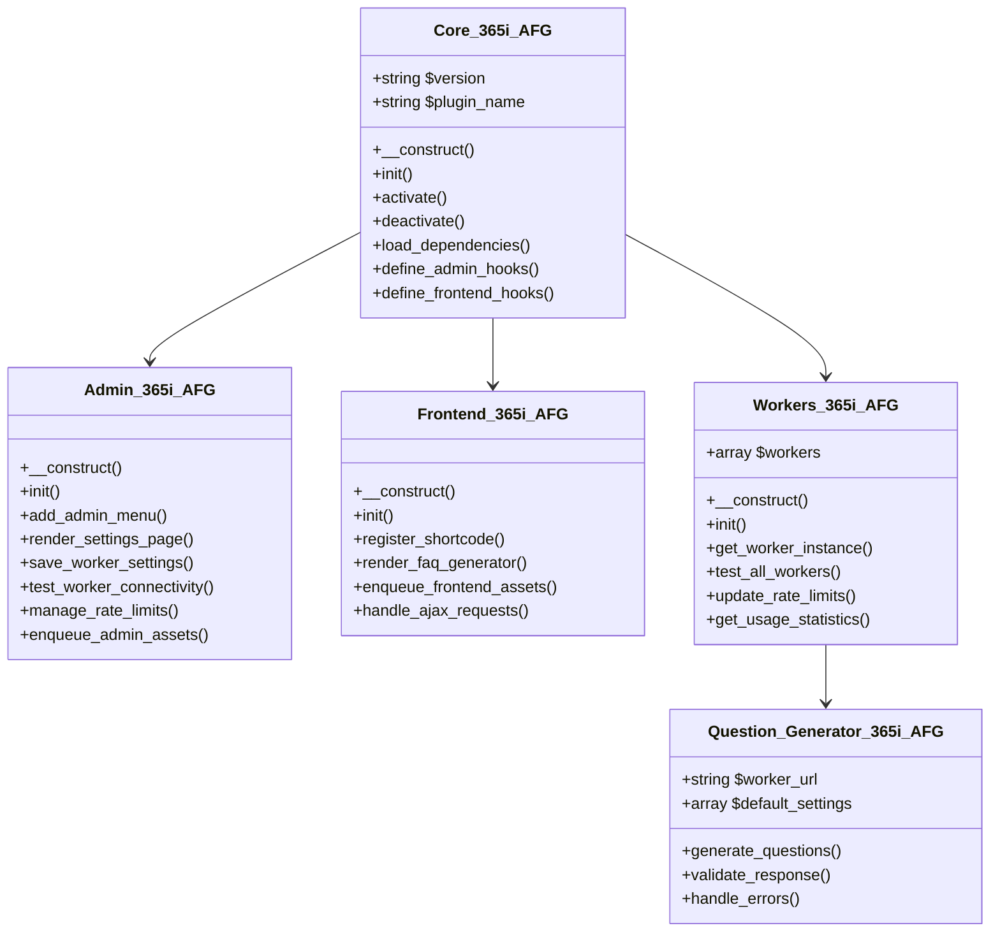

# 365i AI FAQ Generator - WordPress Plugin Implementation Plan

## 📋 Project Overview

**Product Name**: 365i AI FAQ Generator WordPress Plugin  
**Version**: 2.0 (Complete Rebuild)  
**Target Platform**: WordPress Plugin for 365i.co.uk  
**Development Environment**: VS Code with Claude 4 Sonnet integration  
**Local Development**: Windows 11, MAMP, E:\Development\  
**Cloudflare Workers**: 6 production workers fully analyzed and documented  

## 🎯 Project Vision

Create a professional, enterprise-grade WordPress plugin that integrates all 6 existing Cloudflare AI workers to provide a powerful FAQ generation tool. The plugin will feature an admin interface matching provided mockups, a public frontend tool accessible via shortcode, and complete WordPress.org repository compliance.

## 🚀 Core Requirements Summary

### **Frontend Tool Specifications**
- **Access Method**: Shortcode `[ai_faq_generator]` with parameters
- **Deployment**: WordPress page using shortcode widget
- **User Access**: Completely public - no authentication required
- **Storage**: Pure local storage in browser (no WordPress database integration)
- **Functionality**: Export-only FAQ generation and management
- **Features**: Local version history, real-time schema preview, drag-and-drop sorting

### **Admin Interface Requirements**
- **Worker Configuration**: 6 worker panels matching provided mockups
- **Default URLs**: Pre-configured worker URLs with admin override capability
- **Rate Limit Management**: WordPress admin controls for Cloudflare KV namespaces
- **Testing Suite**: Built-in connectivity testing for all workers
- **Documentation**: Integrated setup guides and troubleshooting

### **WordPress Compliance**
- **Standards**: Full WordPress.org repository compliance
- **Security**: Complete PHPCS WordPress-Plugin standard compliance
- **Documentation**: Comprehensive PHPDoc for all functions/classes
- **Prefixing**: All functions/classes prefixed with `365i_AFG_`
- **Text Domain**: `365i-ai-faq-generator`

## 🤖 Cloudflare Workers Infrastructure Analysis

### **Production Workers (6 Total)**

#### **1. Question Generator Worker**
- **File**: [`faq-realtime-assistant-worker/src/index.js`](faq-ai-workers/faq-realtime-assistant-worker/src/index.js)
- **URL**: `https://faq-realtime-assistant-worker.winter-cake-bf57.workers.dev`
- **Model**: `@cf/meta/llama-3.1-8b-instruct`
- **Functionality**: Contextual question generation with duplicate prevention
- **Features**: Grammar checking, context awareness, existing FAQ integration
- **Rate Limit**: Configurable via KV (default: 100/hour)
- **Response Time**: 3-5 seconds

#### **2. Answer Generator Worker**
- **File**: [`faq-answer-generator-worker/src/index.js`](faq-ai-workers/faq-answer-generator-worker/src/index.js)
- **URL**: `https://faq-answer-generator-worker.winter-cake-bf57.workers.dev`
- **Model**: `@cf/meta/llama-3.1-8b-instruct`
- **Functionality**: Multiple answer generation modes (generate, improve, validate, expand)
- **Features**: Sophisticated duplicate prevention, tone adjustment, length control
- **Rate Limit**: Configurable via KV (default: 50/hour)
- **Response Time**: 3-5 seconds

#### **3. FAQ Enhancer Worker**
- **File**: [`faq-enhancement-worker/src/index.js`](faq-ai-workers/faq-enhancement-worker/src/index.js)
- **URL**: `https://faq-enhancement-worker.winter-cake-bf57.workers.dev`
- **Model**: `@cf/meta/llama-3.1-8b-instruct`
- **Functionality**: FAQ improvement with 2 answer types (optimised/detailed)
- **Features**: Page context extraction, session caching, SEO analysis
- **Rate Limit**: 50/day per IP
- **Response Time**: 5-8 seconds

#### **4. SEO Analyzer Worker**
- **File**: [`faq-seo-analyzer-worker/src/index.js`](faq-ai-workers/faq-seo-analyzer-worker/src/index.js)
- **URL**: `https://faq-seo-analyzer-worker.winter-cake-bf57.workers.dev`
- **Model**: `@cf/meta/llama-4-scout-17b-16e-instruct`
- **Functionality**: SEO analysis and Position Zero optimization
- **Features**: Expert-level scoring, keyword analysis, optimization suggestions
- **Rate Limit**: Configurable via KV (default: 75/hour)
- **Response Time**: 5-10 seconds

#### **5. FAQ Extractor Worker**
- **File**: [`faq-proxy-fetch/src/index.js`](faq-ai-workers/faq-proxy-fetch/src/index.js)
- **URL**: `https://faq-proxy-fetch.winter-cake-bf57.workers.dev`
- **Functionality**: Extract existing FAQ schema from websites
- **Features**: JSON-LD/Microdata/RDFa extraction, HTML sanitization, image processing
- **Rate Limit**: 100/day per IP
- **Response Time**: 5-15 seconds

#### **6. Topic Generator Worker**
- **File**: [`url-to-faq-generator-worker/src/index.js`](faq-ai-workers/url-to-faq-generator-worker/src/index.js)
- **URL**: `https://url-to-faq-generator-worker.winter-cake-bf57.workers.dev`
- **Model**: `@cf/meta/llama-4-scout-17b-16e-instruct`
- **Functionality**: Generate comprehensive FAQ sets from website URLs
- **Features**: Premium deep analysis (15K content), multi-pass optimization
- **Rate Limit**: 10/hour per IP
- **Response Time**: 15-30 seconds

### **Rate Limiting Architecture**
- **KV Storage**: Cloudflare KV namespace `FAQ_RATE_LIMITS`
- **WordPress Control**: Admin settings update worker KV stores
- **Per-IP Limits**: Individual tracking per client IP address
- **Dynamic Updates**: Real-time limit adjustments from WordPress admin
- **Usage Tracking**: Dashboard monitoring and analytics

## 🏗️ WordPress Plugin Architecture

### **File Structure**
```
365i-ai-faq-generator/
├── 365i-ai-faq-generator.php           # Main plugin file
├── readme.txt                         # WordPress.org readme
├── includes/
│   ├── class-365i-afg-core.php         # Core plugin class
│   ├── class-365i-afg-admin.php        # Admin interface
│   ├── class-365i-afg-frontend.php     # Frontend shortcode
│   ├── class-365i-afg-workers.php      # Worker integration
│   ├── class-365i-afg-docs.php         # Documentation system
│   └── workers/
│       ├── class-365i-afg-question-generator.php
│       ├── class-365i-afg-answer-generator.php
│       ├── class-365i-afg-faq-enhancer.php
│       ├── class-365i-afg-seo-analyzer.php
│       ├── class-365i-afg-faq-extractor.php
│       └── class-365i-afg-topic-generator.php
├── admin/
│   ├── css/
│   │   ├── admin-styles.css
│   │   └── admin-styles.min.css
│   ├── js/
│   │   ├── admin-scripts.js
│   │   └── admin-scripts.min.js
│   └── views/
│       ├── admin-dashboard.php
│       ├── worker-settings.php
│       ├── rate-limits.php
│       └── documentation.php
├── frontend/
│   ├── css/
│   │   ├── faq-generator.css
│   │   └── faq-generator.min.css
│   ├── js/
│   │   ├── faq-generator.js
│   │   ├── local-storage.js
│   │   ├── schema-generator.js
│   │   ├── quill-editor.js
│   │   └── worker-api.js
│   └── templates/
│       ├── faq-generator-container.php
│       ├── faq-item.php
│       └── schema-preview.php
├── docs/
│   ├── setup-guides/
│   │   ├── cloudflare-kv-setup.md
│   │   ├── worker-configuration.md
│   │   └── troubleshooting.md
│   ├── api-reference/
│   │   ├── worker-endpoints.md
│   │   └── shortcode-parameters.md
│   └── user-guides/
│       ├── quick-start.md
│       └── advanced-features.md
└── assets/
    ├── images/
    ├── icons/
    └── fonts/
```

### **Core Class Architecture**



## 📋 Implementation Phases

### **Phase 1: WordPress Foundation (Days 1-2)**
#### **Core Plugin Structure**
- **Main Plugin File**: WordPress header, activation/deactivation hooks
- **Core Class**: Plugin initialization, dependency loading, hook management
- **Security Framework**: ABSPATH checks, nonces, sanitization functions
- **Options Management**: WordPress options API for settings storage
- **Activation Setup**: Default worker URLs, initial configuration

#### **WordPress Compliance Setup**
- **PHPDoc Standards**: Complete documentation for all functions/classes
- **Coding Standards**: WordPress-Plugin PHPCS compliance
- **Text Domain**: Internationalization setup with `365i-ai-faq-generator`
- **Function Prefixing**: All functions prefixed with `365i_AFG_`
- **Hook Naming**: Consistent WordPress hook naming conventions

### **Phase 2: Worker Integration System (Days 3-4)**
#### **Worker API Classes**
- **Individual Worker Classes**: One class per worker with consistent interface
- **Default URLs**: Hard-coded production worker URLs with override capability
- **Error Handling**: Graceful failure with user-friendly error messages
- **Timeout Management**: 30-second timeouts with retry logic
- **Response Validation**: JSON validation and sanitization

#### **Rate Limiting System**
- **KV Integration**: WordPress admin controls for Cloudflare KV namespace
- **Usage Tracking**: Real-time monitoring of API usage per worker
- **Limit Management**: Dynamic rate limit updates from WordPress admin
- **Testing Suite**: Built-in connectivity testing for all 6 workers

### **Phase 3: Admin Interface (Days 5-6)**
#### **Settings Pages Structure**
- **Main Dashboard**: Overview of all workers and usage statistics
- **Worker Configuration**: Individual panels for each of 6 workers
- **Rate Limit Management**: Visual controls for KV namespace management
- **Documentation Integration**: Built-in guides and troubleshooting

#### **Admin Interface Features**
- **Mockup Compliance**: Exact replication of provided admin mockup designs
- **Worker Testing**: One-click connectivity testing with detailed results
- **Usage Analytics**: Historical data and usage trend visualization
- **Settings Import/Export**: Backup and restore configuration settings

### **Phase 4: Frontend Tool (Days 7-9)**
#### **Shortcode Implementation**
- **Primary Shortcode**: `[ai_faq_generator]`
- **Parameters**:
  - `page_url=""` - URL for AI context gathering
  - `container_class=""` - Custom CSS class for styling
  - `default_count="12"` - Initial number of FAQ items
  - `theme=""` - Visual theme selection (optional)
  - `height=""` - Container height (optional)

#### **Frontend Features**
- **Local Storage System**: Browser-based FAQ management with auto-save
- **Version History**: Track changes with restore capability
- **Rich Text Editor**: Quill.js integration for answer formatting
- **Drag & Drop**: Sortable FAQ items with visual feedback
- **Real-time Preview**: Schema generation in multiple formats
- **Export Functions**: JSON-LD, Microdata, RDFa, HTML export options

#### **AI Integration**
- **Contextual Suggestions**: AI appears below input fields when needed
- **Worker Communication**: AJAX calls to WordPress backend → Cloudflare Workers
- **Response Handling**: Loading states, error handling, success feedback
- **Duplication Prevention**: Smart checking against existing FAQs

### **Phase 5: Documentation & Testing (Days 10-12)**
#### **Built-in Documentation System**
- **Setup Wizards**: Step-by-step Cloudflare KV namespace configuration
- **Worker Guides**: Individual documentation for each of 6 workers
- **Troubleshooting**: Common issues and resolution steps
- **API Reference**: Complete endpoint documentation with examples

#### **Testing & Optimization**
- **Cross-browser Testing**: Chrome, Firefox, Safari, Edge compatibility
- **Mobile Responsiveness**: Full functionality on mobile/tablet devices
- **Performance Testing**: Load time optimization and memory management
- **Security Audit**: WordPress security best practices verification

## 🎨 Frontend Tool Specifications

### **Shortcode Usage Examples**
```php
// Basic implementation
[ai_faq_generator]

// With page context
[ai_faq_generator page_url="https://365i.co.uk/services"]

// Custom styling and count
[ai_faq_generator container_class="custom-faq-tool" default_count="8"]

// Full configuration
[ai_faq_generator page_url="https://365i.co.uk/about" container_class="enterprise-faq" default_count="15" theme="professional"]
```

### **Local Storage Architecture**
```javascript
// FAQ Data Structure
const faqData = {
    id: 'uuid-v4',
    created: '2024-01-01T00:00:00Z',
    updated: '2024-01-01T12:00:00Z',
    page_url: 'https://365i.co.uk/services',
    faqs: [
        {
            id: 'faq-uuid',
            question: 'What are your business hours?',
            answer: 'We are open Monday to Friday...',
            anchor: 'business-hours',
            created: '2024-01-01T00:00:00Z',
            updated: '2024-01-01T00:30:00Z'
        }
    ],
    version_history: [
        {
            timestamp: '2024-01-01T00:30:00Z',
            action: 'faq_added',
            data: { faq_id: 'faq-uuid' }
        }
    ]
};
```

### **Schema Generation System**
#### **Supported Formats**
1. **JSON-LD** (Google preferred)
2. **Microdata** (HTML5 embedded)
3. **RDFa** (Resource Description Framework)
4. **HTML** (Clean semantic markup)

#### **Real-time Preview Interface**
```
┌─────────────────────────────────────────────────────────┐
│ 📊 Schema Preview (Collapsible Sidebar)                │
├─────────────────────────────────────────────────────────┤
│ Format: [JSON-LD ▼] [📋 Copy] [💾 Download]            │
├─────────────────────────────────────────────────────────┤
│ {                                                       │
│   "@context": "https://schema.org",                    │
│   "@type": "FAQPage",                                  │
│   "mainEntity": [                                      │
│     {                                                  │
│       "@type": "Question",                            │
│       "name": "What are your business hours?",        │
│       "acceptedAnswer": {                             │
│         "@type": "Answer",                            │
│         "text": "We are open Monday to Friday..."     │
│       }                                               │
│     }                                                 │
│   ]                                                   │
│ }                                                     │
└─────────────────────────────────────────────────────────┘
```

## 🔐 Security & Compliance Implementation

### **WordPress Security Standards**
#### **Input Sanitization**
```php
// Text fields
$worker_url = sanitize_url( $_POST['worker_url'] );
$rate_limit = absint( $_POST['rate_limit'] );
$description = sanitize_textarea_field( $_POST['description'] );

// Array data
$worker_settings = array_map( 'sanitize_text_field', $_POST['workers'] );
```

#### **Output Escaping**
```php
// HTML output
echo esc_html( $worker_name );
echo esc_url( $worker_url );
echo esc_attr( $css_class );

// JSON output
wp_send_json_success( $sanitized_data );
```

#### **Nonce Verification**
```php
// Form submission
wp_verify_nonce( $_POST['_wpnonce'], '365i_afg_save_settings' );

// AJAX requests
check_ajax_referer( '365i_afg_ajax_nonce', 'nonce' );
```

#### **Capability Checks**
```php
// Admin functions
if ( ! current_user_can( 'manage_options' ) ) {
    wp_die( __( 'You do not have sufficient permissions.', '365i-ai-faq-generator' ) );
}
```

### **PHPCS WordPress-Plugin Compliance**
- **Zero Errors**: Complete compliance with WordPress-Plugin standard
- **Automated Testing**: CI/CD integration for continuous compliance checking
- **Code Documentation**: 100% PHPDoc coverage for all functions/classes
- **Performance**: Optimized database queries with `$wpdb->prepare()`

## 📱 User Interface Specifications

### **Admin Interface Layout**
```
WordPress Admin → 365i FAQ Generator
├── Dashboard
│   ├── Worker Status Overview
│   ├── Usage Statistics
│   ├── Recent Activity
│   └── Quick Actions
├── Worker Settings
│   ├── Question Generator
│   │   ├── URL Configuration
│   │   ├── Rate Limits
│   │   ├── Test Connection
│   │   └── Advanced Options
│   ├── Answer Generator
│   │   └── [Similar controls]
│   ├── FAQ Enhancer
│   │   └── [Similar controls]
│   ├── SEO Analyzer
│   │   └── [Similar controls]
│   ├── FAQ Extractor
│   │   └── [Similar controls]
│   └── Topic Generator
│       └── [Similar controls]
├── Rate Limit Management
│   ├── KV Namespace Status
│   ├── Usage Analytics
│   ├── Limit Configuration
│   └── Testing Tools
├── Documentation
│   ├── Setup Guides
│   ├── API Reference
│   ├── Troubleshooting
│   └── Support Resources
└── Advanced Settings
    ├── Debug Mode
    ├── Performance Options
    ├── Security Settings
    └── Import/Export
```

### **Frontend Tool Interface**
```
┌─────────────────────────────────────────────────────────┐
│ 🤖 AI FAQ Generator                                     │
├─────────────────────────────────────────────────────────┤
│ ➕ Add New FAQ | 📁 Import from URL | ⚙️ Settings       │
├─────────────────────────────────────────────────────────┤
│ FAQ Management Area                                     │
│ ┌─────────────────────────────────────────────────────┐ │
│ │ 🔸 Question: What are your business hours?          │ │
│ │    💡 AI Suggest | ✏️ Edit | 🗑️ Delete            │ │
│ │                                                    │ │
│ │ 📝 Answer: We are open Monday to Friday...         │ │
│ │    💡 AI Enhance | ✏️ Edit | 📋 Preview           │ │
│ │                                                    │ │
│ │ 🔗 Anchor: business-hours                          │ │
│ └─────────────────────────────────────────────────────┘ │
│ [Additional FAQ items with drag-and-drop handles]      │
├─────────────────────────────────────────────────────────┤
│ 📤 Export Schema                                       │
│ [JSON-LD] [Microdata] [RDFa] [HTML] [Copy All]        │
├─────────────────────────────────────────────────────────┤
│ 📊 Schema Preview (Toggleable Sidebar)                │
│ Real-time preview of generated schema in selected      │
│ format with copy-to-clipboard functionality            │
└─────────────────────────────────────────────────────────┘
```

## ⚡ Performance & Optimization

### **Frontend Performance**
- **Asset Loading**: Conditional loading only when shortcode is present
- **Code Splitting**: Separate bundles for core vs advanced features
- **Caching Strategy**: Smart localStorage and browser caching
- **Bundle Size**: Optimized with minification and compression

### **Backend Performance**
- **Minimal Database Usage**: WordPress options API only for settings
- **Efficient Queries**: Optimized database interactions
- **Caching**: WordPress transients for worker responses where appropriate
- **Memory Management**: Efficient resource usage for large FAQ sets

### **API Performance**
- **Timeout Management**: 30-second timeouts with exponential backoff retry
- **Error Recovery**: Graceful degradation when workers unavailable
- **Request Optimization**: Batched requests where possible
- **Response Caching**: Smart caching of AI responses in localStorage

## 🧪 Testing Strategy

### **Unit Testing**
- **WordPress Functions**: Test all WordPress hooks and filters
- **Worker Integration**: Mock worker responses for reliable testing
- **Frontend Functions**: JavaScript unit tests for all major functions
- **Security Testing**: Validate all sanitization and escaping functions

### **Integration Testing**
- **End-to-End**: Complete workflow testing from admin to frontend
- **Cross-browser**: Chrome, Firefox, Safari, Edge compatibility
- **Mobile Testing**: iOS Safari, Chrome Mobile, Android browsers
- **WordPress Compatibility**: Test with popular themes and plugins

### **Performance Testing**
- **Load Testing**: Performance with large FAQ sets (100+ items)
- **Memory Testing**: Memory usage optimization and leak detection
- **Network Testing**: Functionality with slow/unreliable connections
- **Accessibility Testing**: WCAG 2.1 AA compliance verification

## 📚 Documentation System

### **Built-in WordPress Admin Documentation**
#### **Setup Guides**
- **Initial Configuration**: Plugin activation and basic setup
- **Cloudflare KV Setup**: Step-by-step KV namespace configuration
- **Worker Configuration**: Individual setup guides for all 6 workers
- **Troubleshooting**: Common issues and resolution steps

#### **User Guides**
- **Quick Start**: 5-minute setup and first FAQ creation
- **Advanced Features**: Power user functionality and optimization
- **Best Practices**: SEO optimization and content quality tips
- **Integration**: Using with other WordPress plugins and themes

#### **Developer Documentation**
- **API Reference**: Complete endpoint documentation with examples
- **Hook Reference**: All WordPress actions and filters provided
- **Customization**: Theme integration and custom styling guides
- **Extension**: Guidelines for extending plugin functionality

## 🚀 Success Metrics & Goals

### **Functional Success Criteria**
- ✅ All 6 Cloudflare workers integrated and functional
- ✅ Admin interface exactly matches provided mockup designs
- ✅ Shortcode works on any WordPress page with full functionality
- ✅ Local storage system preserves data across browser sessions
- ✅ Real-time schema preview in all 4 formats (JSON-LD, Microdata, RDFa, HTML)
- ✅ Export functionality works for all schema formats
- ✅ WordPress.org repository compliance (PHPCS, Plugin Check, security)

### **Performance Success Criteria**
- ✅ Initial plugin load under 2 seconds
- ✅ AI worker responses under 5 seconds (95% of requests)
- ✅ Smooth 60fps animations on modern devices
- ✅ Full functionality on mobile/tablet devices
- ✅ Works across all major browsers (Chrome, Firefox, Safari, Edge)

### **Quality Success Criteria**
- ✅ Zero PHPCS errors with WordPress-Plugin standard
- ✅ Zero errors in WordPress Plugin Check
- ✅ WCAG 2.1 AA accessibility compliance
- ✅ Comprehensive error handling with user-friendly messages
- ✅ Complete PHPDoc documentation for all code

## 🔄 Development Workflow

### **Version Control**
- **Repository**: Local development in `E:\Development\plugins\365i-ai-faq-generator\`
- **Branching**: Feature branches for each development phase
- **Commits**: Detailed commit messages following WordPress standards
- **Documentation**: Update documentation with each feature addition

### **Code Quality**
- **PHPCS**: WordPress-Plugin standard enforcement
- **ESLint**: JavaScript code quality and consistency
- **Testing**: Unit tests for all critical functionality
- **Documentation**: Inline code documentation and user guides

### **Deployment Process**
- **Development**: Local MAMP environment testing
- **Staging**: WordPress staging site testing
- **Production**: 365i.co.uk deployment with monitoring
- **Maintenance**: Regular updates and WordPress compatibility testing

---

## 📞 Support & Maintenance

### **Technical Support Resources**
- **Documentation**: Comprehensive built-in WordPress admin documentation
- **Troubleshooting**: Detailed guides for common issues and solutions
- **API Reference**: Complete documentation for all worker endpoints
- **Examples**: Working code examples for all major features

### **Maintenance Plan**
- **WordPress Updates**: Regular compatibility testing with new WordPress versions
- **Worker Monitoring**: Automated monitoring of all 6 Cloudflare workers
- **Security Updates**: Regular security audits and updates
- **Performance Optimization**: Ongoing performance monitoring and improvements

---

**This implementation plan provides a complete roadmap for developing the 365i AI FAQ Generator WordPress plugin, incorporating all existing Cloudflare worker infrastructure, admin interface requirements, frontend tool specifications, and WordPress.org compliance standards.**

**Total Estimated Development Time**: 12 days across 5 phases
**Estimated Lines of Code**: ~8,000-10,000 lines (PHP + JavaScript + CSS)
**Target Deployment**: 365i.co.uk WordPress installation
**Success Criteria**: Full functionality, WordPress compliance, performance targets met

**Ready for implementation approval and code development phase.**