# Detailed Plan: Making 365i Queue Optimizer Ready for WordPress Repository Submission

Based on a review of your plugin files and WordPress repository guidelines, this document outlines a comprehensive plan to make your 365i Queue Optimizer ready for submission. The current plugin is well-constructed but needs several adjustments to fully comply with WordPress repository standards and follow best practices.

## Current State Assessment

Your plugin currently has:
- Main plugin file (`365i-queue-optimizer.php`)
- Admin class (`admin/class-settings-page.php`)
- CSS file (`assets/css/admin.css`)
- Documentation (`readme.txt` and `CHANGELOG.md`)

While this structure works, it doesn't fully align with repository requirements or your custom guideline requirements for src/ and templates/ directories.

## Required Changes

### 1. Directory Structure Reorganization

```mermaid
graph TD
    A[365i-queue-optimizer] --> B[365i-queue-optimizer.php]
    A --> C[uninstall.php]
    A --> D[index.php]
    A --> E[readme.txt]
    A --> F[LICENSE.txt]
    A --> G[CHANGELOG.md]
    A --> H[languages/]
    H --> H1[365i-queue-optimizer.pot]
    H --> H2[index.php]
    A --> I[src/]
    I --> I1[class-queue-optimizer-main.php]
    I --> I2[index.php]
    A --> J[admin/]
    J --> J1[class-settings-page.php]
    J --> J2[index.php]
    A --> K[templates/]
    K --> K1[admin/]
    K1 --> K1a[settings-page.php]
    K1 --> K1b[index.php]
    K --> K2[partials/]
    K2 --> K2a[header.php]
    K2 --> K2b[footer.php]
    K2 --> K2c[index.php]
    K --> K3[index.php]
    A --> L[assets/]
    L --> L1[css/]
    L1 --> L1a[admin.css]
    L1 --> L1b[index.php]
    L --> L2[js/]
    L2 --> L2a[admin.js]
    L2 --> L2b[index.php]
    L --> L3[images/]
    L3 --> L3a[screenshot-1.png]
    L3 --> L3b[screenshot-2.png]
    L3 --> L3c[index.php]
    L --> L4[index.php]
```

### 2. File Additions

1. **Security Files**:
   - Add `index.php` files to all directories with the content "<?php // Silence is golden."
   - This prevents directory listing if server security is misconfigured

2. **Required WordPress Files**:
   - Create `uninstall.php` to replace the current static uninstall method
   - Add `LICENSE.txt` with the full GPL v2 license text
   - Create a translation template file (`languages/365i-queue-optimizer.pot`)

3. **Screenshots**:
   - Add screenshot files referenced in readme.txt (at least 2 screenshots)
   - Name them `screenshot-1.png` and `screenshot-2.png` in the assets/images/ directory

### 3. Code Separation

1. **Move Main Class to src/ Directory**:
   - Create `src/class-queue-optimizer-main.php` and move the core class there
   - Update the main plugin file to require this file

2. **Separate HTML and PHP**:
   - Move HTML from `class-settings-page.php` to template files:
     - `templates/admin/settings-page.php`
     - `templates/partials/header.php`
     - `templates/partials/footer.php`
   - Update admin class to load these templates

3. **Add JavaScript File**:
   - Create `assets/js/admin.js` for any JavaScript functionality
   - Ensure it's properly enqueued

### 4. Code Modifications

1. **Main Plugin File**:
   - Update file structure references
   - Fix any paths for requiring files
   - Replace static uninstall method with register_uninstall_hook pointing to uninstall.php

2. **Settings Page Class**:
   - Replace HTML output with template loading
   - Ensure all outputs are properly escaped
   - Add filter hooks around data arrays for extensibility

3. **Uninstall Script**:
   - Move uninstall logic to dedicated uninstall.php file
   - Ensure proper security checks are in place

### 5. Documentation Updates

1. **Readme.txt**:
   - Verify all sections follow the exact WordPress repository format
   - Ensure screenshot references match the actual files

2. **CHANGELOG.md**:
   - Update to reflect the restructuring changes

## Implementation Plan

### Phase 1: File and Directory Structure

1. Create the new directory structure
2. Add index.php files to all directories
3. Create LICENSE.txt file
4. Prepare screenshot image files

### Phase 2: Code Separation

1. Move the main class to src/ directory
2. Create template files and move HTML from PHP classes
3. Create JavaScript file if needed
4. Update references and paths

### Phase 3: Additional Requirements

1. Create uninstall.php
2. Generate language template file
3. Update main plugin file to reference new structure

### Phase 4: Testing and Validation

1. Test the reorganized plugin functionality
2. Validate against WordPress coding standards
3. Check for security vulnerabilities
4. Validate readme.txt format

## Benefits of These Changes

1. **Better Security**: Adding index.php files and proper uninstall handling
2. **Improved Maintainability**: Separating code and templates
3. **Enhanced Extensibility**: Adding filter hooks around data arrays
4. **Full Compliance**: Meeting all WordPress repository requirements
5. **Better User Experience**: Adding proper screenshots and documentation

## WordPress Plugin Guidelines Compliance Checklist

The WordPress Plugin Directory has specific guidelines that must be followed:

- [ ] Plugin is GPL compatible (v2 or later)
- [ ] Plugin does not include trademarked content without permission
- [ ] Plugin doesn't do anything illegal or morally offensive
- [ ] Plugin follows all WordPress coding standards and security best practices
- [ ] Plugin doesn't utilize "phoning home" without explicit user consent
- [ ] Plugin doesn't hijack WordPress functionality or display unwanted ads
- [ ] Plugin has a clear and specific function that doesn't overlap with core
- [ ] Plugin README.txt follows WordPress repository format
- [ ] Plugin provides clean uninstall process
- [ ] Plugin includes proper translation support
- [ ] Plugin has appropriate directory protection with index.php files
- [ ] Plugin has all required license information
- [ ] Plugin includes screenshots referenced in README.txt