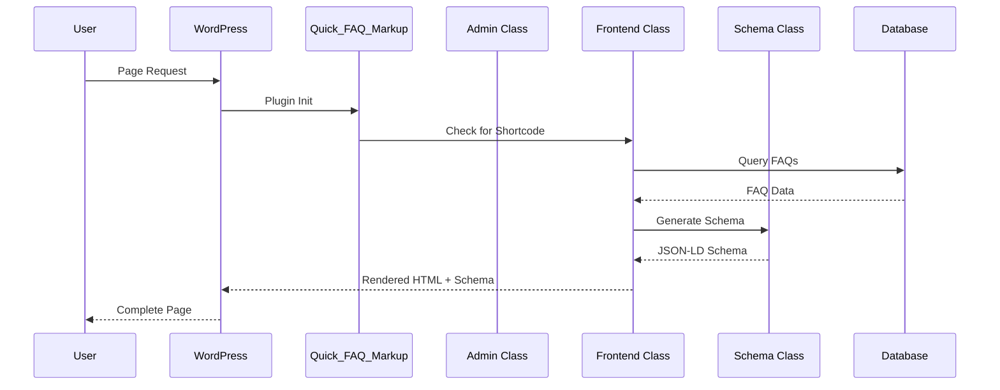
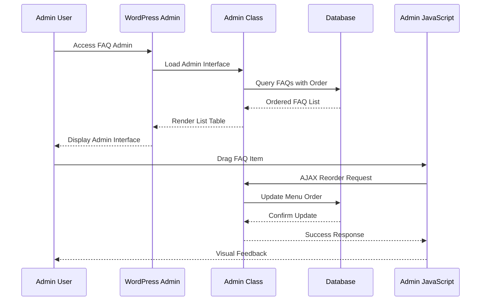
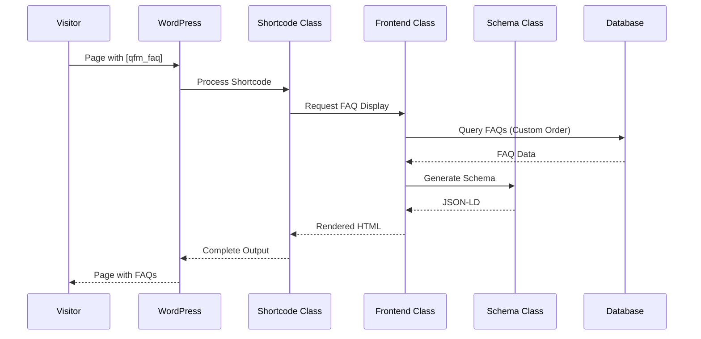

# Quick FAQ Markup - Technical Architecture Documentation

## Overview

This document provides comprehensive technical architecture documentation for the Quick FAQ Markup WordPress plugin. The plugin follows WordPress 2025 coding standards and implements a modular, secure, and maintainable architecture.

## Plugin Information

- **Plugin Name**: Quick FAQ Markup
- **Text Domain**: quick-faq-markup
- **Version**: 1.0.0
- **Requirements**: WordPress 6.0+, PHP 8.0+
- **License**: GPL v2 or later

## File Structure & Organization

```
quick-faq-markup/
├── quick-faq-markup.php              # Main plugin file - Bootstrap & constants
├── readme.txt                        # WordPress repository readme
├── LICENSE                          # GPL v2 license file
├── uninstall.php                    # Cleanup on plugin uninstall
├── includes/                        # Core plugin classes
│   ├── class-quick-faq-markup.php           # Main plugin orchestration class
│   ├── class-quick-faq-markup-admin.php     # Admin interface & post type management
│   ├── class-quick-faq-markup-frontend.php  # Frontend display & rendering
│   ├── class-quick-faq-markup-schema.php    # JSON-LD schema generation
│   └── class-quick-faq-markup-shortcode.php # Shortcode registration & handling
├── admin/                           # Admin-specific assets & templates
│   ├── css/
│   │   └── quick-faq-markup-admin.css       # Admin interface styles
│   ├── js/
│   │   └── quick-faq-markup-admin.js        # Admin JavaScript (drag-drop)
│   └── partials/
│       ├── faq-meta-box.php          # FAQ meta box template
│       └── settings-page.php         # Plugin settings page template
├── public/                          # Frontend assets
│   ├── css/
│   │   └── quick-faq-markup-public.css      # Frontend FAQ styles (4 themes)
│   └── js/
│       └── quick-faq-markup-public.js       # Frontend JavaScript (accordion)
└── languages/                       # Internationalization files
    └── quick-faq-markup.pot         # Translation template
```

### File Purpose & Responsibilities

#### Core Files
- **`quick-faq-markup.php`**: Plugin bootstrap, constants, activation hooks
- **`uninstall.php`**: Data cleanup on plugin removal
- **`readme.txt`**: WordPress repository metadata and documentation

#### Class Files (`includes/`)
- **`class-quick-faq-markup.php`**: Main orchestration and dependency injection
- **`class-quick-faq-markup-admin.php`**: Admin interface, post type, drag-drop reordering
- **`class-quick-faq-markup-frontend.php`**: Frontend display logic and style rendering
- **`class-quick-faq-markup-schema.php`**: JSON-LD schema markup generation
- **`class-quick-faq-markup-shortcode.php`**: Shortcode registration and attribute processing

#### Asset Files
- **Admin CSS**: List table styling, drag-drop interface, meta box styling
- **Admin JS**: jQuery sortable, AJAX handlers, order management
- **Frontend CSS**: 4 display styles with WCAG 2.1 AA compliance
- **Frontend JS**: Accordion functionality, keyboard navigation

## Class Architecture & Relationships

### Main Plugin Class (`Quick_FAQ_Markup`)

```php
/**
 * Main plugin orchestration class
 */
class Quick_FAQ_Markup {
    protected $loader;
    protected $plugin_name;
    protected $version;
    protected $admin;
    protected $frontend;
    protected $schema;
    protected $shortcode;
    
    public function __construct();
    public function run();
    public function get_plugin_name();
    public function get_version();
    private function load_dependencies();
    private function set_locale();
    private function define_admin_hooks();
    private function define_public_hooks();
}
```

**Responsibilities:**
- Plugin initialization and bootstrapping
- Dependency injection and class instantiation
- Hook registration coordination
- Version management

### Admin Class (`Quick_FAQ_Markup_Admin`)

```php
/**
 * Admin-specific functionality and interface
 */
class Quick_FAQ_Markup_Admin {
    private $plugin_name;
    private $version;
    
    public function __construct( $plugin_name, $version );
    public function enqueue_styles();
    public function enqueue_scripts();
    public function register_post_type();
    public function add_meta_boxes();
    public function save_meta_data( $post_id );
    public function add_admin_columns( $columns );
    public function populate_admin_columns( $column, $post_id );
    public function make_columns_sortable( $sortable_columns );
    public function handle_ajax_reorder();
    public function handle_single_faq_order();
    public function create_settings_page();
    public function register_settings();
}
```

**Responsibilities:**
- Custom post type registration with ordering support
- Meta box creation and data persistence
- Drag-and-drop reordering interface
- AJAX handlers for order management
- Settings page administration
- Admin list table customization

### Frontend Class (`Quick_FAQ_Markup_Frontend`)

```php
/**
 * Public-facing functionality and display
 */
class Quick_FAQ_Markup_Frontend {
    private $plugin_name;
    private $version;
    
    public function __construct( $plugin_name, $version );
    public function enqueue_styles();
    public function enqueue_scripts();
    public function display_faqs( $args = array() );
    public function render_faq_output( $faqs, $style = 'classic', $show_anchors = true );
    public function generate_faq_anchor( $question, $faq_id );
    public function apply_style_template( $style, $faqs );
    public function add_anchor_targeting_script();
    private function query_faqs( $args = array() );
    private function get_cached_faqs( $args );
}
```

**Responsibilities:**
- Frontend asset management (conditional loading)
- FAQ query handling with custom ordering
- Style template rendering (4 display options)
- Anchor generation for direct linking
- Performance optimization and caching

### Schema Class (`Quick_FAQ_Markup_Schema`)

```php
/**
 * JSON-LD schema markup generation
 */
class Quick_FAQ_Markup_Schema {
    private $current_page_faqs;
    
    public function __construct();
    public function generate_faq_schema( $faqs, $page_url = '' );
    public function output_schema_to_head();
    public function validate_schema( $schema );
    public function get_page_faqs();
    private function has_faq_shortcode();
    private function generate_faq_anchor( $question, $faq_id );
}
```

**Responsibilities:**
- JSON-LD FAQ schema generation
- Schema validation and error handling
- Head section injection
- URL context management for direct links

### Shortcode Class (`Quick_FAQ_Markup_Shortcode`)

```php
/**
 * Shortcode registration and processing
 */
class Quick_FAQ_Markup_Shortcode {
    private $frontend;
    private $schema;
    
    public function __construct( $frontend, $schema );
    public function register_shortcode();
    public function shortcode_handler( $atts );
    public function parse_attributes( $atts );
    public function get_faq_output( $style, $category, $limit, $order, $ids, $show_anchors );
    private function validate_shortcode_attributes( $atts );
    private function sanitize_shortcode_inputs( $atts );
}
```

**Responsibilities:**
- Shortcode registration with WordPress
- Attribute parsing and validation
- Integration with frontend display system
- Schema markup coordination

## Data Flow Architecture

### Request/Response Cycle



### Admin Interface Flow



### Frontend Display Flow



## Database Schema Design

### Custom Post Type Structure

```sql
-- FAQ Post Type: qfm_faq
-- Uses wp_posts table with custom post_type
```

**Fields Used:**
- `post_type`: `'qfm_faq'`
- `post_title`: FAQ title (used for admin identification)
- `post_content`: Not used (kept for potential future use)
- `post_status`: `'publish'` or `'draft'`
- `menu_order`: FAQ display order (drag-and-drop)
- `post_modified`: Last update timestamp

### Meta Fields Schema

```sql
-- FAQ Meta Fields (wp_postmeta)
-- Key: meta_key, Value: meta_value
```

**Meta Field Structure:**
- `_qfm_faq_question`: FAQ question text (TEXT)
- `_qfm_faq_answer`: FAQ answer text (LONGTEXT, allows HTML)
- `_qfm_faq_category`: FAQ category/group (VARCHAR)
- `_qfm_faq_order`: Manual order override (INT)

### Options Table Entries

```sql
-- Plugin Settings (wp_options)
-- option_name: option_value
```

**Settings Structure:**
- `quick_faq_markup_settings`: Serialized array of plugin settings
- `quick_faq_markup_version`: Plugin version for update management

### Database Indexing Strategy

**Recommended Indexes:**
```sql
-- For performance optimization
CREATE INDEX idx_qfm_post_type_order ON wp_posts(post_type, menu_order);
CREATE INDEX idx_qfm_meta_question ON wp_postmeta(meta_key, meta_value(100));
CREATE INDEX idx_qfm_meta_category ON wp_postmeta(meta_key, meta_value(50));
```

### Query Optimization Patterns

**Efficient FAQ Queries:**
```php
$args = array(
    'post_type' => 'qfm_faq',
    'post_status' => 'publish',
    'orderby' => 'menu_order',
    'order' => 'ASC',
    'posts_per_page' => $limit,
    'meta_query' => array(
        array(
            'key' => '_qfm_faq_question',
            'compare' => 'EXISTS'
        )
    )
);
```

## Security Architecture

### Input Sanitization Matrix

| Input Type | Sanitization Function | Usage Context |
|------------|----------------------|---------------|
| FAQ Question | `sanitize_textarea_field()` | Meta box forms |
| FAQ Answer | `wp_kses_post()` | Meta box forms (allows HTML) |
| Shortcode Attributes | `sanitize_text_field()` | Shortcode processing |
| AJAX Data | `sanitize_text_field()` + validation | AJAX handlers |
| URLs | `esc_url()` | Schema generation |

### Nonce Implementation Pattern

```php
// 2025 Enhanced Nonce Pattern
public function save_meta_data( $post_id ) {
    // Sanitize nonce before verification
    $nonce = sanitize_text_field( wp_unslash( $_POST['qfm_faq_meta_box_nonce'] ?? '' ) );
    
    // Verify nonce
    if ( ! wp_verify_nonce( $nonce, 'qfm_faq_meta_box' ) ) {
        wp_die( esc_html__( 'Security verification failed.', 'quick-faq-markup' ) );
    }
    
    // Additional security checks...
}
```

### Capability-Based Access Control

```php
// Access Control Matrix
if ( ! current_user_can( 'edit_post', $post_id ) ) {
    wp_die( esc_html__( 'Insufficient permissions.', 'quick-faq-markup' ) );
}
```

## Performance Optimization

### Conditional Asset Loading

```php
// Only load assets when needed
public function enqueue_styles() {
    if ( $this->has_faq_shortcode() || is_singular( 'qfm_faq' ) ) {
        wp_enqueue_style( $this->plugin_name, plugin_dir_url( __FILE__ ) . 'css/quick-faq-markup-public.css', array(), $this->version, 'all' );
    }
}
```

### Caching Strategy

```php
// FAQ Query Caching
public function get_cached_faqs( $args ) {
    $cache_key = 'qfm_faqs_' . md5( serialize( $args ) );
    $faqs = wp_cache_get( $cache_key, 'quick_faq_markup' );
    
    if ( false === $faqs ) {
        $faqs = $this->query_faqs( $args );
        wp_cache_set( $cache_key, $faqs, 'quick_faq_markup', HOUR_IN_SECONDS );
    }
    
    return $faqs;
}
```

## Accessibility Implementation

### WCAG 2.1 AA Compliance

**Keyboard Navigation:**
- Tab navigation through FAQ items
- Enter/Space key activation
- Arrow key navigation between items

**Screen Reader Support:**
- Proper ARIA attributes (`aria-expanded`, `aria-controls`)
- Semantic HTML structure
- Screen reader only text for context

**Focus Management:**
- Visible focus indicators
- Logical tab order
- Focus restoration after interactions

## Internationalization Architecture

### Text Domain Management

```php
// WordPress 6.8+ Auto-loading
// No load_plugin_textdomain() required
// Text domain declared in plugin header
```

### Translation Function Usage

```php
// Standard translation patterns
__( 'Add New FAQ', 'quick-faq-markup' )
_e( 'FAQ Settings', 'quick-faq-markup' )
esc_html__( 'Security verification failed.', 'quick-faq-markup' )
_x( 'Classic', 'FAQ display style', 'quick-faq-markup' )
```

## Hook & Filter Architecture

### Action Hooks

```php
// Admin Hooks
add_action( 'init', array( $this, 'register_post_type' ) );
add_action( 'add_meta_boxes', array( $this, 'add_meta_boxes' ) );
add_action( 'save_post', array( $this, 'save_meta_data' ) );
add_action( 'wp_ajax_qfm_update_faq_order', array( $this, 'handle_ajax_reorder' ) );

// Frontend Hooks
add_action( 'wp_enqueue_scripts', array( $this, 'enqueue_scripts' ) );
add_action( 'wp_head', array( $this, 'output_schema_to_head' ), 5 );
```

### Filter Hooks

```php
// Customization Filters
add_filter( 'qfm_faq_query_args', array( $this, 'modify_query_args' ) );
add_filter( 'qfm_faq_output', array( $this, 'modify_output' ) );
add_filter( 'qfm_schema_data', array( $this, 'modify_schema' ) );
```

## Error Handling & Logging

### Error Handling Strategy

```php
// Graceful error handling
public function handle_ajax_reorder() {
    try {
        // Process reorder logic
        wp_send_json_success( $message );
    } catch ( Exception $e ) {
        error_log( 'QFM Error: ' . $e->getMessage() );
        wp_send_json_error( __( 'An error occurred.', 'quick-faq-markup' ) );
    }
}
```

### Logging Integration

```php
// Centralized logging (when available)
if ( function_exists( 'centralized_log' ) ) {
    centralized_log( 'QFM: FAQ reordered', 'info' );
}
```

## Testing Architecture

### Unit Testing Structure

```php
// Test class structure
class Quick_FAQ_Markup_Test extends WP_UnitTestCase {
    public function setUp();
    public function test_schema_generation();
    public function test_shortcode_processing();
    public function test_reorder_functionality();
}
```

### Integration Testing

- Theme compatibility testing
- Plugin conflict resolution
- Performance benchmarking
- Cross-browser validation

This architecture provides a solid foundation for a maintainable, secure, and scalable WordPress FAQ plugin that meets all 2025 coding standards and repository requirements.