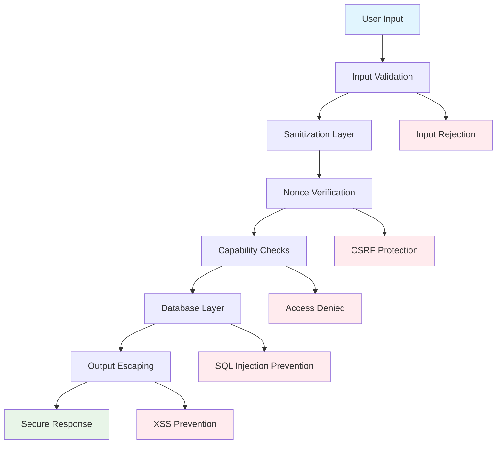

# Quick FAQ Markup - Security Standards Implementation

## Overview

This document outlines the comprehensive security implementation strategy for the Quick FAQ Markup WordPress plugin, adhering to WordPress 2025 enhanced security standards and best practices.

## Security Framework Architecture

### Security Layers



### Security Principles

1. **Defense in Depth**: Multiple security layers
2. **Least Privilege**: Minimal required permissions
3. **Input Validation**: All input validated and sanitized
4. **Output Escaping**: All output properly escaped
5. **Secure by Default**: Security-first implementation

---

## Input Sanitization Standards

### Sanitization Function Matrix

| Input Type | Context | Sanitization Function | Usage Example |
|------------|---------|----------------------|---------------|
| FAQ Question | Meta Box | `sanitize_textarea_field()` | Form submissions |
| FAQ Answer | Meta Box | `wp_kses_post()` | HTML content allowed |
| Shortcode Attributes | Public | `sanitize_text_field()` | User parameters |
| Category Names | Admin | `sanitize_text_field()` | Category taxonomy |
| Order Numbers | Admin | `absint()` | Numeric values |
| URLs | Schema | `esc_url()` | URL validation |
| File Paths | Internal | `sanitize_file_name()` | File operations |
| Email Addresses | Contact | `sanitize_email()` | Email validation |
| HTML Content | Editor | `wp_kses_post()` | Rich text content |
| Raw Text | Display | `sanitize_text_field()` | Plain text |

### Implementation Patterns

#### FAQ Question Sanitization
```php
/**
 * Sanitize FAQ question input
 *
 * @param string $question Raw question input
 * @return string Sanitized question
 */
private function sanitize_faq_question( $question ) {
    // Remove extra whitespace and sanitize
    $question = sanitize_textarea_field( wp_unslash( $question ) );
    
    // Additional validation
    if ( empty( trim( $question ) ) ) {
        return '';
    }
    
    // Length validation
    if ( strlen( $question ) > 500 ) {
        $question = substr( $question, 0, 500 );
    }
    
    return $question;
}
```

#### FAQ Answer Sanitization
```php
/**
 * Sanitize FAQ answer with HTML support
 *
 * @param string $answer Raw answer input
 * @return string Sanitized answer
 */
private function sanitize_faq_answer( $answer ) {
    // Allow specific HTML tags
    $allowed_tags = array(
        'p' => array(),
        'br' => array(),
        'strong' => array(),
        'em' => array(),
        'ul' => array(),
        'ol' => array(),
        'li' => array(),
        'a' => array(
            'href' => array(),
            'title' => array(),
            'target' => array()
        )
    );
    
    return wp_kses( wp_unslash( $answer ), $allowed_tags );
}
```

#### Shortcode Attribute Sanitization
```php
/**
 * Sanitize shortcode attributes
 *
 * @param array $atts Raw attributes
 * @return array Sanitized attributes
 */
private function sanitize_shortcode_attributes( $atts ) {
    $sanitized = array();
    
    // Style validation
    $valid_styles = array( 'classic', 'accordion-modern', 'accordion-minimal', 'cards' );
    $sanitized['style'] = in_array( $atts['style'], $valid_styles ) ? $atts['style'] : 'classic';
    
    // Category sanitization
    $sanitized['category'] = sanitize_text_field( $atts['category'] );
    
    // Limit validation
    $sanitized['limit'] = absint( $atts['limit'] );
    $sanitized['limit'] = min( $sanitized['limit'], 100 ); // Maximum 100
    
    // Order validation
    $valid_orders = array( 'custom', 'date_desc', 'date_asc', 'title_asc', 'title_desc' );
    $sanitized['order'] = in_array( $atts['order'], $valid_orders ) ? $atts['order'] : 'custom';
    
    // IDs validation
    if ( ! empty( $atts['ids'] ) ) {
        $ids = explode( ',', $atts['ids'] );
        $sanitized['ids'] = array_map( 'absint', $ids );
        $sanitized['ids'] = array_filter( $sanitized['ids'] ); // Remove zeros
    }
    
    return $sanitized;
}
```

---

## Nonce Implementation (2025 Enhanced Standards)

### Nonce Generation Pattern

```php
/**
 * Generate nonce for FAQ operations
 *
 * @param string $action Nonce action
 * @return string Nonce value
 */
private function generate_faq_nonce( $action ) {
    return wp_create_nonce( 'qfm_' . $action . '_' . get_current_user_id() );
}
```

### Nonce Verification Pattern (2025 Standard)

```php
/**
 * Verify nonce with enhanced 2025 standards
 *
 * @param string $nonce_value Nonce to verify
 * @param string $action Nonce action
 * @return bool Verification result
 */
private function verify_faq_nonce( $nonce_value, $action ) {
    // Sanitize nonce before verification (2025 requirement)
    $nonce_value = sanitize_text_field( wp_unslash( $nonce_value ) );
    
    // Verify nonce
    if ( ! wp_verify_nonce( $nonce_value, 'qfm_' . $action . '_' . get_current_user_id() ) ) {
        return false;
    }
    
    return true;
}
```

### Meta Box Nonce Implementation

```php
/**
 * Save FAQ meta data with enhanced nonce verification
 *
 * @param int $post_id Post ID
 */
public function save_meta_data( $post_id ) {
    // Check if user can edit this post
    if ( ! current_user_can( 'edit_post', $post_id ) ) {
        return;
    }
    
    // Verify nonce (2025 enhanced pattern)
    $nonce_field = $_POST['qfm_faq_meta_box_nonce'] ?? '';
    if ( ! $this->verify_faq_nonce( $nonce_field, 'meta_box' ) ) {
        wp_die( 
            esc_html__( 'Security verification failed. Please refresh the page and try again.', 'quick-faq-markup' ),
            esc_html__( 'Security Error', 'quick-faq-markup' ),
            array( 'response' => 403 )
        );
    }
    
    // Check autosave
    if ( defined( 'DOING_AUTOSAVE' ) && DOING_AUTOSAVE ) {
        return;
    }
    
    // Verify post type
    if ( 'qfm_faq' !== get_post_type( $post_id ) ) {
        return;
    }
    
    // Process and save data
    $this->process_faq_meta_save( $post_id );
}
```

### AJAX Nonce Implementation

```php
/**
 * Handle AJAX FAQ reordering with nonce verification
 */
public function handle_ajax_reorder() {
    // Verify nonce (2025 enhanced)
    $nonce = $_POST['nonce'] ?? '';
    if ( ! $this->verify_faq_nonce( $nonce, 'reorder' ) ) {
        wp_send_json_error( 
            array( 
                'message' => __( 'Security verification failed.', 'quick-faq-markup' ),
                'code' => 'nonce_verification_failed'
            )
        );
    }
    
    // Check capabilities
    if ( ! current_user_can( 'edit_posts' ) ) {
        wp_send_json_error( 
            array( 
                'message' => __( 'Insufficient permissions.', 'quick-faq-markup' ),
                'code' => 'insufficient_permissions'
            )
        );
    }
    
    // Process reorder request
    $this->process_ajax_reorder();
}
```

---

## Capability-Based Access Control

### Permission Matrix

| Action | Required Capability | Context | Verification Method |
|--------|-------------------|---------|-------------------|
| Create FAQ | `edit_posts` | Admin | `current_user_can()` |
| Edit FAQ | `edit_post` | Admin | `current_user_can( 'edit_post', $post_id )` |
| Delete FAQ | `delete_post` | Admin | `current_user_can( 'delete_post', $post_id )` |
| Reorder FAQs | `edit_posts` | Admin | `current_user_can()` |
| Plugin Settings | `manage_options` | Admin | `current_user_can()` |
| View FAQs | `read` | Frontend | `current_user_can()` |

### Implementation Patterns

#### Post-Specific Permissions
```php
/**
 * Check if user can edit specific FAQ
 *
 * @param int $post_id FAQ post ID
 * @return bool Permission status
 */
private function can_edit_faq( $post_id ) {
    // Check post type
    if ( 'qfm_faq' !== get_post_type( $post_id ) ) {
        return false;
    }
    
    // Check edit capability
    if ( ! current_user_can( 'edit_post', $post_id ) ) {
        return false;
    }
    
    return true;
}
```

#### Settings Page Permissions
```php
/**
 * Check if user can manage plugin settings
 *
 * @return bool Permission status
 */
private function can_manage_settings() {
    return current_user_can( 'manage_options' );
}
```

#### AJAX Permission Verification
```php
/**
 * Verify AJAX request permissions
 *
 * @param string $action Action being performed
 * @param int $post_id Optional post ID
 * @return bool Permission granted
 */
private function verify_ajax_permissions( $action, $post_id = 0 ) {
    switch ( $action ) {
        case 'reorder':
            return current_user_can( 'edit_posts' );
            
        case 'edit_faq':
            return $post_id && current_user_can( 'edit_post', $post_id );
            
        case 'delete_faq':
            return $post_id && current_user_can( 'delete_post', $post_id );
            
        default:
            return false;
    }
}
```

---

## Database Security

### Prepared Statements Pattern

```php
/**
 * Secure database query using prepared statements
 *
 * @param array $args Query arguments
 * @return array FAQ results
 */
private function secure_faq_query( $args ) {
    global $wpdb;
    
    $defaults = array(
        'limit' => 10,
        'offset' => 0,
        'category' => '',
        'order' => 'ASC'
    );
    
    $args = wp_parse_args( $args, $defaults );
    
    // Validate inputs
    $limit = absint( $args['limit'] );
    $offset = absint( $args['offset'] );
    $category = sanitize_text_field( $args['category'] );
    $order = in_array( $args['order'], array( 'ASC', 'DESC' ) ) ? $args['order'] : 'ASC';
    
    // Prepared statement query
    $sql = $wpdb->prepare(
        "SELECT p.ID, p.post_title, p.menu_order, pm1.meta_value as question, pm2.meta_value as answer
        FROM {$wpdb->posts} p
        LEFT JOIN {$wpdb->postmeta} pm1 ON p.ID = pm1.post_id AND pm1.meta_key = %s
        LEFT JOIN {$wpdb->postmeta} pm2 ON p.ID = pm2.post_id AND pm2.meta_key = %s
        WHERE p.post_type = %s 
        AND p.post_status = %s
        " . ( $category ? "AND EXISTS (SELECT 1 FROM {$wpdb->postmeta} pm3 WHERE pm3.post_id = p.ID AND pm3.meta_key = %s AND pm3.meta_value = %s)" : "" ) . "
        ORDER BY p.menu_order {$order}
        LIMIT %d OFFSET %d",
        '_qfm_faq_question',
        '_qfm_faq_answer',
        'qfm_faq',
        'publish',
        $category ? '_qfm_faq_category' : '',
        $category ? $category : '',
        $limit,
        $offset
    );
    
    return $wpdb->get_results( $sql );
}
```

### Meta Data Security

```php
/**
 * Securely save FAQ meta data
 *
 * @param int $post_id Post ID
 * @param array $meta_data Meta data to save
 */
private function secure_meta_save( $post_id, $meta_data ) {
    foreach ( $meta_data as $key => $value ) {
        // Validate meta key
        if ( ! in_array( $key, $this->get_allowed_meta_keys() ) ) {
            continue;
        }
        
        // Sanitize based on key type
        $sanitized_value = $this->sanitize_meta_value( $key, $value );
        
        // Update meta (WordPress handles escaping)
        update_post_meta( $post_id, $key, $sanitized_value );
    }
}

/**
 * Get allowed meta keys
 *
 * @return array Allowed meta keys
 */
private function get_allowed_meta_keys() {
    return array(
        '_qfm_faq_question',
        '_qfm_faq_answer',
        '_qfm_faq_category',
        '_qfm_faq_order'
    );
}
```

---

## Output Escaping Standards

### Context-Aware Escaping

| Output Context | Escaping Function | Usage |
|---------------|------------------|--------|
| HTML Content | `esc_html()` | Plain text display |
| HTML Attributes | `esc_attr()` | Attribute values |
| URLs | `esc_url()` | Link href values |
| JavaScript | `esc_js()` | JS variables |
| CSS | `esc_css()` | CSS values |
| Rich Content | `wp_kses_post()` | HTML content |
| Raw Output | `wp_kses()` | Custom HTML rules |

### Implementation Examples

#### Frontend FAQ Display
```php
/**
 * Safely render FAQ output
 *
 * @param array $faqs FAQ data
 * @param string $style Display style
 * @return string Safe HTML output
 */
public function render_safe_faq_output( $faqs, $style = 'classic' ) {
    $output = '<div class="qfm-faq-container qfm-style-' . esc_attr( $style ) . '">';
    
    foreach ( $faqs as $faq ) {
        $anchor = $this->generate_safe_anchor( $faq['question'], $faq['id'] );
        
        $output .= '<div class="qfm-faq-item" id="' . esc_attr( $anchor ) . '">';
        
        if ( 'accordion-modern' === $style ) {
            $output .= '<button class="qfm-faq-question" aria-expanded="false">';
            $output .= esc_html( $faq['question'] );
            $output .= '</button>';
            $output .= '<div class="qfm-faq-answer">';
            $output .= wp_kses_post( $faq['answer'] );
            $output .= '</div>';
        } else {
            $output .= '<h3 class="qfm-faq-question">';
            $output .= esc_html( $faq['question'] );
            $output .= '<a href="#' . esc_attr( $anchor ) . '" class="qfm-permalink">';
            $output .= esc_html__( '#', 'quick-faq-markup' );
            $output .= '</a></h3>';
            $output .= '<div class="qfm-faq-answer">';
            $output .= wp_kses_post( $faq['answer'] );
            $output .= '</div>';
        }
        
        $output .= '</div>';
    }
    
    $output .= '</div>';
    
    return $output;
}
```

#### Admin Interface Output
```php
/**
 * Safely render admin list column
 *
 * @param string $column Column name
 * @param int $post_id Post ID
 */
public function render_safe_admin_column( $column, $post_id ) {
    switch ( $column ) {
        case 'faq_question':
            $question = get_post_meta( $post_id, '_qfm_faq_question', true );
            echo esc_html( wp_trim_words( $question, 10 ) );
            break;
            
        case 'faq_order':
            $order = get_post_field( 'menu_order', $post_id );
            echo '<input type="number" class="small-text qfm-order-input" value="' . esc_attr( $order ) . '" data-post-id="' . esc_attr( $post_id ) . '" min="0" />';
            break;
            
        case 'faq_shortcode':
            echo '<code>[qfm_faq ids="' . esc_attr( $post_id ) . '"]</code>';
            break;
    }
}
```

#### JavaScript Data Passing
```php
/**
 * Safely pass data to JavaScript
 */
public function enqueue_admin_scripts() {
    wp_enqueue_script( 
        'qfm-admin', 
        plugin_dir_url( __FILE__ ) . 'js/quick-faq-markup-admin.js', 
        array( 'jquery', 'jquery-ui-sortable' ), 
        $this->version, 
        false 
    );
    
    // Safe data passing
    wp_localize_script( 'qfm-admin', 'qfmAdmin', array(
        'ajaxUrl' => esc_url( admin_url( 'admin-ajax.php' ) ),
        'nonce' => wp_create_nonce( 'qfm_admin_nonce' ),
        'messages' => array(
            'orderUpdated' => esc_js( __( 'Order updated successfully.', 'quick-faq-markup' ) ),
            'orderError' => esc_js( __( 'Failed to update order.', 'quick-faq-markup' ) ),
            'confirmDelete' => esc_js( __( 'Are you sure you want to delete this FAQ?', 'quick-faq-markup' ) )
        )
    ) );
}
```

---

## Security Headers & Protection

### CSRF Protection
```php
/**
 * Add CSRF protection headers
 */
public function add_security_headers() {
    if ( is_admin() ) {
        header( 'X-Content-Type-Options: nosniff' );
        header( 'X-Frame-Options: SAMEORIGIN' );
        header( 'X-XSS-Protection: 1; mode=block' );
    }
}
```

### Direct File Access Prevention
```php
<?php
/**
 * Prevent direct file access
 */
if ( ! defined( 'ABSPATH' ) ) {
    exit; // Exit if accessed directly
}
```

### Input Rate Limiting
```php
/**
 * Rate limit AJAX requests
 *
 * @param string $action Action name
 * @return bool Rate limit check
 */
private function check_rate_limit( $action ) {
    $user_id = get_current_user_id();
    $key = 'qfm_rate_limit_' . $action . '_' . $user_id;
    $count = get_transient( $key );
    
    if ( false === $count ) {
        set_transient( $key, 1, MINUTE_IN_SECONDS );
        return true;
    }
    
    if ( $count >= 10 ) { // Max 10 requests per minute
        return false;
    }
    
    set_transient( $key, $count + 1, MINUTE_IN_SECONDS );
    return true;
}
```

---

## Security Audit Checklist

### Pre-Deployment Security Audit

#### Input Validation
- [ ] All user inputs sanitized with appropriate functions
- [ ] Input length limits enforced
- [ ] Data type validation implemented
- [ ] Whitelist validation for enum values

#### Authentication & Authorization
- [ ] Nonce verification on all forms
- [ ] Capability checks on all actions
- [ ] User session validation
- [ ] Permission escalation prevention

#### Database Security
- [ ] Prepared statements used for all queries
- [ ] SQL injection prevention verified
- [ ] Database error information not exposed
- [ ] Sensitive data encrypted where appropriate

#### Output Security
- [ ] All outputs properly escaped
- [ ] Context-appropriate escaping functions used
- [ ] XSS prevention verified
- [ ] HTML filtering implemented correctly

#### File Security
- [ ] Direct file access prevented
- [ ] File upload validation (if applicable)
- [ ] Path traversal prevention
- [ ] Secure file permissions

#### Error Handling
- [ ] Graceful error handling implemented
- [ ] Sensitive information not exposed in errors
- [ ] Appropriate HTTP status codes used
- [ ] Error logging without information disclosure

### WordPress-Specific Security

#### Core Integration
- [ ] WordPress APIs used instead of direct database access
- [ ] Hooks and filters properly implemented
- [ ] WordPress security features not bypassed
- [ ] Theme/plugin compatibility maintained

#### Standards Compliance
- [ ] WordPress coding standards followed
- [ ] Security best practices implemented
- [ ] Plugin Check tool passes
- [ ] No PHP warnings or errors

This comprehensive security framework ensures that the Quick FAQ Markup plugin meets the highest security standards while maintaining usability and functionality.